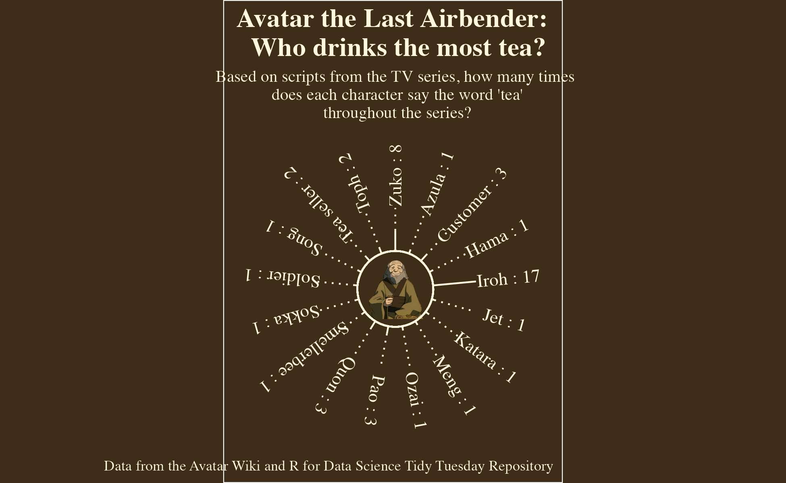

```{r setup, include=FALSE}
knitr::opts_chunk$set(echo = TRUE)
```

I do a bit of knitting, which feels comfortably creative because I can follow patterns and not make a single creative decision if I do not feel comfortable. It's been an artistic outlet that has allowed me to lean into my creativity with some structure, which I like and need. This small project felt similar. 

Curious about aRt in R, I decided to watch the [R Ladies Sana Barbara](https://www.meetup.com/rladies-santa-barbara/) talk with [Ijeamaka Anyene](https://ijeamaka-anyene.netlify.app) titled ["aRt + ggplot: exploring radial visualizations"](https://www.youtube.com/watch?v=h0i6KAahLY8). I was pleased to find that the concepts were simple enough to try as I watched Ijeamaka share her gorgeous artwork. To me the simple, beautiful effect of adding `+ coord_polar` to my `ggplot` bar graphs was amazing, and something I might not have considered on my own, much like new techniques in a knitting pattern :) 

Like Ijeamaka, I applied the techniques of radial visualizations to [a Tidy Tuesday dataset from 2020 which contains the entire script for the Nickelodeon cartoon series, _Avatar: the Last Airbender._](https://github.com/rfordatascience/tidytuesday/tree/master/data/2020/2020-08-11) I search for places where characters talk about tea, group by character to figure out who is doing th most talking about tea, and visualize _"Who drinks the most tea?"_ I tweeted my results and received kind praise from [Ijeamaka via her Twitter](https://twitter.com/ijeamaka_a), which made me feel so COOL! I'm thankful for her generous instruction and aRtistry inspiration! She's made me think harder about communicating data creatively, beautifully, and in unexpected ways! 

# Load Libraries

```{r}
library(tidyverse)
library(ggplot2)
library(stringr)
library(ggimage)
library(here)

iroh = here("_posts", "2022-01-17-avatar-the-last-airbender-who-drinks-the-most-tea", "images", "iroh_2.png")
```

# Load Data from [Tidy Tuesday Github Respository](https://github.com/rfordatascience/tidytuesday/tree/master/data/2020/2020-08-11). 

```{r}
tuesdata <- tidytuesdayR::tt_load('2020-08-11')
avatar <- tuesdata$avatar
```


# Wrangle Data for Tea String Search

```{r}
#search the scripts for places where characters say the word "tea" and keep all those observations
tea_data <- avatar %>% 
  mutate(tea_mentions = str_count(full_text,
                                 " tea ")) %>% 
  group_by(character) %>% 
  summarise(tea_mentions_sum = sum(tea_mentions, na.rm = TRUE)) %>% 
  filter(tea_mentions_sum > 0) %>% 
  filter(character != "Scene Description")

team_mentions_max = max(tea_data$tea_mentions_sum)
```

# Create Circular ggplot of "Tea Mentions"

```{r fig.alt = "Circular bar graph with bar magnitude indicating the number of times Avatar characters said the word 'tea' throughout the series. Iroh likes tea the most, with 17 utterances, followed by Zuko with 8. An image of Iroh is in the center of the graph. "}

#create an index for my characters - to be used for x axis of my ggplot
tea_data$index <- 1:nrow(tea_data)

#set angles for characters based on the number of characters in my ggplot (the labels will be placed in a circle, and we want to be able to read them! )
number_characters = nrow(tea_data)
id = seq(1:number_characters)
angle = 90 - 360 * (id) / number_characters
tea_data$angle = ifelse(angle < -90, angle + 180, angle)

#create a ggplot of 
iroh_tt <- ggplot(data = tea_data) +
  geom_segment(aes(x = index,
                   xend = index,
                   y = 0,
                   yend = tea_mentions_sum),
               color = "cornsilk") +
  geom_segment(aes(x = index,
                   xend = index,
                   y = tea_mentions_sum,
                   yend = team_mentions_max),
               linetype = 'dotted',
                 color = "cornsilk") +
  geom_image(aes(x = 8.5,
                 y = -15,
                 image = iroh),
             size = .25) +
  geom_segment(x = 0,
               xend = 17,
               y = 0,
               yend = 0,
               color = "cornsilk") +
   coord_polar() +
   xlim(0, 17) +
   ylim(-15, 35) +
  geom_text(aes(x = index,
                y = 30,
                label = paste0(character, " : ", tea_mentions_sum)),
            angle = angle,
            family = 'serif',
            color = "cornsilk") +
  labs(title = "Avatar the Last Airbender: \n Who drinks the most tea?",
       subtitle = "Based on scripts from the TV series, how many times\n does each character say the word 'tea'\n throughout the series?",
       caption = "Data from the Avatar Wiki and R for Data Science Tidy Tuesday Repository") +
  theme(panel.background = element_rect("#3D2D19"),
        plot.background = element_rect(fill = "#3D2D19"),
        panel.grid = element_blank(),
        axis.text = element_blank(),
        axis.title = element_blank(),
        axis.ticks = element_blank(),
        text = element_text(family = 'serif',
                            color = "cornsilk"),
        plot.title = element_text(size = 16, face = 'bold', hjust = 0.5),
        plot.subtitle = element_text(size = 10, hjust = 0.5))

#save png for website
ggsave("iroh_tt.png",
       path = here("_posts", "2022-01-17-avatar-the-last-airbender-who-drinks-the-most-tea", "images"))
```




Distill is a publication format for scientific and technical writing, native to the web.

Learn more about using Distill at <https://rstudio.github.io/distill>.


