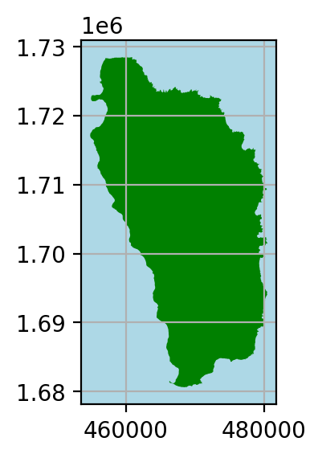
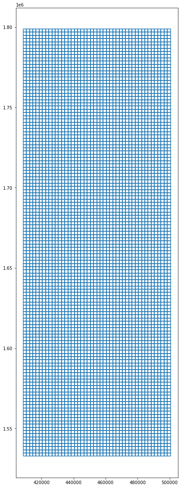
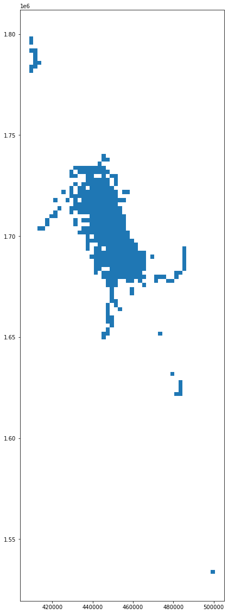
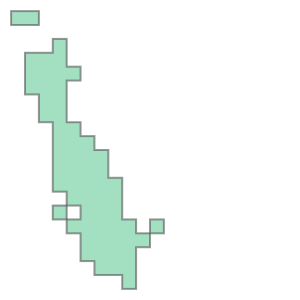
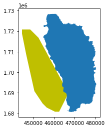

# **EDS 223 Assignment 3: Protecting Whales from Ships**

## Meghan Fletcher and Scout Leonard 

### Setup


```python
#load libraries 
import pandas as pd
import geopandas as gpd
import matplotlib.pyplot as plt
import os
import numpy as np
from shapely.geometry import Polygon
```

### Dominica Outline

Define file path for Dominica spatial data:


```python
input_folder = r"data/dominica"
dominica_shapefile = "dma_admn_adm0_py_s1_dominode_v2.shp"

dominica_fp = os.path.join(input_folder, dominica_shapefile)
```

Read file using `read_file()`:


```python
dominica_data = gpd.read_file(dominica_fp)
```

Change the CRS from WGS 84 to Dominica 1945:


```python
dominica_2002 = dominica_data.to_crs("EPSG:2002")
```

Plot the outline for exploration:


```python
fig, ax = plt.subplots(figsize=(3, 3), dpi=200)
ax.grid(True)
ax.set_facecolor('lightblue')

dominica_2002.plot(ax = ax, color = 'green')
```


    <AxesSubplot:>


    

    


### Whale Sighting Data

Define file path for whale sighting spatial data:


```python
sightings_input_folder = r"data"
sightings_csv = "sightings2005_2018.csv"

sightings_fp = os.path.join(sightings_input_folder, sightings_csv)
```

Read file using `read_file()`:


```python
sightings_data = gpd.read_file(sightings_fp)
```

Bootstrap the geometries:


```python
sightings_points = gpd.points_from_xy(sightings_data['Long'], sightings_data['Lat'])
```

Project the dataset into a Geo Data Frame with the appropriate CRS:


```python
sightings_gdf_4326 = gpd.GeoDataFrame(sightings_data, geometry=sightings_points, crs = 'EPSG:4326')
```


```python
sightings_gdf_2002 = sightings_gdf_4326.to_crs("EPSG:2002")
```

#### Create Grid

Define the grid's boundaries:


```python
minx, miny, maxx, maxy = sightings_gdf_2002.total_bounds
```

Define the grid's cell size, in meters:


```python
cell_size = 2000
```


```python
xs = np.arange(minx, maxx, cell_size)
ys = np.arange(miny, maxy, cell_size)
```


```python
def make_cell(x, y, cell_size):
    ring = [
        (x, y),
        (x + cell_size, y),
        (x + cell_size, y + cell_size),
        (x, y + cell_size)
    ]
    cell = Polygon(ring)
    return cell
```


```python
cells = []
for x in xs:
    for y in ys:
        cell = make_cell(x, y, cell_size)
        cells.append(cell)
```

Create a grid `GeoDataFrame`, containing a cell for each row:


```python
grid = gpd.GeoDataFrame({'geometry': cells}, crs=2002)
```

Plot the grid to see how it looks:
    
We adjust the figure size so the cells are more visible than in the default grid: 


```python
grid.boundary.plot(figsize = (10,20))
```


    <AxesSubplot:>


    

    


#### Extract Whale Habitat

Spatially join whale sightings data with grid data to get whale counts per grid cell:


```python
sightings_with_grid = grid.sjoin(sightings_gdf_2002, how="inner")
sightings_with_grid
```


<div>
<style scoped>
    .dataframe tbody tr th:only-of-type {
        vertical-align: middle;
    }

    .dataframe tbody tr th {
        vertical-align: top;
    }

    .dataframe thead th {
        text-align: right;
    }
</style>
<table border="1" class="dataframe">
  <thead>
    <tr style="text-align: right;">
      <th></th>
      <th>geometry</th>
      <th>index_right</th>
      <th>field_1</th>
      <th>GPStime</th>
      <th>Lat</th>
      <th>Long</th>
    </tr>
  </thead>
  <tbody>
    <tr>
      <th>124</th>
      <td>POLYGON ((408480.652 1780792.746, 410480.652 1...</td>
      <td>4327</td>
      <td>4327</td>
      <td>2018-03-15 06:41:03</td>
      <td>16.127</td>
      <td>-61.896866</td>
    </tr>
    <tr>
      <th>124</th>
      <td>POLYGON ((408480.652 1780792.746, 410480.652 1...</td>
      <td>4328</td>
      <td>4328</td>
      <td>2018-03-15 06:44:05</td>
      <td>16.127666</td>
      <td>-61.900766</td>
    </tr>
    <tr>
      <th>124</th>
      <td>POLYGON ((408480.652 1780792.746, 410480.652 1...</td>
      <td>4329</td>
      <td>4329</td>
      <td>2018-03-15 06:58:17</td>
      <td>16.1305</td>
      <td>-61.903366</td>
    </tr>
    <tr>
      <th>125</th>
      <td>POLYGON ((408480.652 1782792.746, 410480.652 1...</td>
      <td>4330</td>
      <td>4330</td>
      <td>2018-03-15 07:15:33</td>
      <td>16.139583</td>
      <td>-61.900116</td>
    </tr>
    <tr>
      <th>125</th>
      <td>POLYGON ((408480.652 1782792.746, 410480.652 1...</td>
      <td>4331</td>
      <td>4331</td>
      <td>2018-03-15 07:17:30</td>
      <td>16.14175</td>
      <td>-61.897716</td>
    </tr>
    <tr>
      <th>...</th>
      <td>...</td>
      <td>...</td>
      <td>...</td>
      <td>...</td>
      <td>...</td>
      <td>...</td>
    </tr>
    <tr>
      <th>5133</th>
      <td>POLYGON ((484480.652 1690792.746, 486480.652 1...</td>
      <td>1147</td>
      <td>1147</td>
      <td>2008-05-04 16:59:36</td>
      <td>15.304085</td>
      <td>-61.194134</td>
    </tr>
    <tr>
      <th>5134</th>
      <td>POLYGON ((484480.652 1692792.746, 486480.652 1...</td>
      <td>1148</td>
      <td>1148</td>
      <td>2008-05-04 17:43:45</td>
      <td>15.321439</td>
      <td>-61.19188</td>
    </tr>
    <tr>
      <th>5985</th>
      <td>POLYGON ((498480.652 1532792.746, 500480.652 1...</td>
      <td>609</td>
      <td>609</td>
      <td>2005-03-20 11:50:05</td>
      <td>13.86967067</td>
      <td>-61.0794355</td>
    </tr>
    <tr>
      <th>5985</th>
      <td>POLYGON ((498480.652 1532792.746, 500480.652 1...</td>
      <td>611</td>
      <td>611</td>
      <td>2005-03-20 12:56:58</td>
      <td>13.86967067</td>
      <td>-61.0794355</td>
    </tr>
    <tr>
      <th>5985</th>
      <td>POLYGON ((498480.652 1532792.746, 500480.652 1...</td>
      <td>610</td>
      <td>610</td>
      <td>2005-03-20 12:05:10</td>
      <td>13.86967067</td>
      <td>-61.0794355</td>
    </tr>
  </tbody>
</table>
<p>4893 rows × 6 columns</p>
</div>


Plot the Grid Cells with Whale Counts: 


```python
sightings_with_grid.plot(figsize = (10,20))
```


    <AxesSubplot:>


    

    


To ge the count of sightings in each cell, we have to perform a so called _map-reduce_ operation using `groupby` and `count`. This is added to the Geo Data Frame as a new column:


```python
grid['count'] = sightings_with_grid.groupby(sightings_with_grid.index).count()['index_right']
grid
```


<div>
<style scoped>
    .dataframe tbody tr th:only-of-type {
        vertical-align: middle;
    }

    .dataframe tbody tr th {
        vertical-align: top;
    }

    .dataframe thead th {
        text-align: right;
    }
</style>
<table border="1" class="dataframe">
  <thead>
    <tr style="text-align: right;">
      <th></th>
      <th>geometry</th>
      <th>count</th>
    </tr>
  </thead>
  <tbody>
    <tr>
      <th>0</th>
      <td>POLYGON ((408480.652 1532792.746, 410480.652 1...</td>
      <td>NaN</td>
    </tr>
    <tr>
      <th>1</th>
      <td>POLYGON ((408480.652 1534792.746, 410480.652 1...</td>
      <td>NaN</td>
    </tr>
    <tr>
      <th>2</th>
      <td>POLYGON ((408480.652 1536792.746, 410480.652 1...</td>
      <td>NaN</td>
    </tr>
    <tr>
      <th>3</th>
      <td>POLYGON ((408480.652 1538792.746, 410480.652 1...</td>
      <td>NaN</td>
    </tr>
    <tr>
      <th>4</th>
      <td>POLYGON ((408480.652 1540792.746, 410480.652 1...</td>
      <td>NaN</td>
    </tr>
    <tr>
      <th>...</th>
      <td>...</td>
      <td>...</td>
    </tr>
    <tr>
      <th>6113</th>
      <td>POLYGON ((498480.652 1788792.746, 500480.652 1...</td>
      <td>NaN</td>
    </tr>
    <tr>
      <th>6114</th>
      <td>POLYGON ((498480.652 1790792.746, 500480.652 1...</td>
      <td>NaN</td>
    </tr>
    <tr>
      <th>6115</th>
      <td>POLYGON ((498480.652 1792792.746, 500480.652 1...</td>
      <td>NaN</td>
    </tr>
    <tr>
      <th>6116</th>
      <td>POLYGON ((498480.652 1794792.746, 500480.652 1...</td>
      <td>NaN</td>
    </tr>
    <tr>
      <th>6117</th>
      <td>POLYGON ((498480.652 1796792.746, 500480.652 1...</td>
      <td>NaN</td>
    </tr>
  </tbody>
</table>
<p>6118 rows × 2 columns</p>
</div>


Subset grid df to cells with more than 20 sightings:


```python
grid_20 = grid[grid['count'] > 20]
```


```python
grid_20_union = grid_20.unary_union
grid_20_union
```


    

    


Next we create a convex hull using the sightings we joined with `unary_union` to generate the "whale habitat":


```python
habitat_convex_hull = grid_20_union.convex_hull
habitat_convex_hull
```


    

    


Convert the habitat convex hull polygon to a Geo Data Frame:


```python
convex_hull_gdf = gpd.GeoDataFrame(crs = 'EPSG:2002', geometry = [habitat_convex_hull])
```


```python
ax = convex_hull_gdf.plot(color = 'y')

dominica_2002.plot(ax = ax, figsize = (10,20))
```


    <AxesSubplot:>


    

    


### Vessel Data

#### Load Data

Define file path for AIS vessel data:


```python
ais_input_folder = r"data"
ais_csv = "station1249.csv"

ais_fp = os.path.join(ais_input_folder, ais_csv)
```

Read file using `read_file()`:


```python
ais_data = gpd.read_file(ais_fp)
```

Bootstrap the geometries:


```python
ais_points = gpd.points_from_xy(ais_data['LON'], ais_data['LAT'])
```


```python
ais_gdf = gpd.GeoDataFrame(ais_data, geometry=ais_points, crs = 'EPSG:4326')
```

Project to the Dominica 1945 CRS:


```python
ais_gdf = ais_gdf.to_crs("EPSG:2002")
```

The character strings in `TIMESTAMP` are not in a recognized datetime format. We parse those strings here: 


```python
pd.to_datetime(ais_gdf['TIMESTAMP'])
```


    0        2015-05-22 13:53:26
    1        2015-05-22 13:52:57
    2        2015-05-22 13:52:32
    3        2015-05-22 13:52:24
    4        2015-05-22 13:51:23
                     ...        
    617257   2015-05-21 21:34:59
    617258   2015-05-21 21:34:55
    617259   2015-05-21 21:34:46
    617260   2015-05-21 21:34:46
    617261   2015-05-21 21:34:45
    Name: TIMESTAMP, Length: 617262, dtype: datetime64[ns]


Parse strings of the `TIMESTAMP` column to a recognized datetime format:


```python
ais_gdf['TIMESTAMP'] = pd.to_datetime(ais_gdf['TIMESTAMP'])
```

#### Calculate Distance and Speed

Spatially subset vessel data using whale habitat data:


```python
habitat_ais_gdf = ais_gdf.sjoin(convex_hull_gdf, how = 'inner')
```

Sort the dataframe by MMSI (Maritime Mobile Service Identity), the vessel's unique identifier. 


```python
habitat_ais_sorted = habitat_ais_gdf.sort_values(['MMSI', 'TIMESTAMP'])
```

Create a copy of our dataframe and shift each observation down one row using `shift()`.


```python
habitat_ais_copy = habitat_ais_sorted.copy()
habitat_ais_copy
```


<div>
<style scoped>
    .dataframe tbody tr th:only-of-type {
        vertical-align: middle;
    }

    .dataframe tbody tr th {
        vertical-align: top;
    }

    .dataframe thead th {
        text-align: right;
    }
</style>
<table border="1" class="dataframe">
  <thead>
    <tr style="text-align: right;">
      <th></th>
      <th>field_1</th>
      <th>MMSI</th>
      <th>LON</th>
      <th>LAT</th>
      <th>TIMESTAMP</th>
      <th>geometry</th>
      <th>index_right</th>
    </tr>
  </thead>
  <tbody>
    <tr>
      <th>235025</th>
      <td>235025</td>
      <td>203106200</td>
      <td>-61.40929</td>
      <td>15.21021</td>
      <td>2015-02-25 15:32:20</td>
      <td>POINT (462476.396 1680935.224)</td>
      <td>0</td>
    </tr>
    <tr>
      <th>235018</th>
      <td>235018</td>
      <td>203106200</td>
      <td>-61.41107</td>
      <td>15.21436</td>
      <td>2015-02-25 15:34:50</td>
      <td>POINT (462283.995 1681393.698)</td>
      <td>0</td>
    </tr>
    <tr>
      <th>235000</th>
      <td>235000</td>
      <td>203106200</td>
      <td>-61.41427</td>
      <td>15.22638</td>
      <td>2015-02-25 15:42:19</td>
      <td>POINT (461936.769 1682722.187)</td>
      <td>0</td>
    </tr>
    <tr>
      <th>234989</th>
      <td>234989</td>
      <td>203106200</td>
      <td>-61.41553</td>
      <td>15.2353</td>
      <td>2015-02-25 15:47:19</td>
      <td>POINT (461798.818 1683708.377)</td>
      <td>0</td>
    </tr>
    <tr>
      <th>234984</th>
      <td>234984</td>
      <td>203106200</td>
      <td>-61.41687</td>
      <td>15.23792</td>
      <td>2015-02-25 15:49:50</td>
      <td>POINT (461654.150 1683997.765)</td>
      <td>0</td>
    </tr>
    <tr>
      <th>...</th>
      <td>...</td>
      <td>...</td>
      <td>...</td>
      <td>...</td>
      <td>...</td>
      <td>...</td>
      <td>...</td>
    </tr>
    <tr>
      <th>259103</th>
      <td>259103</td>
      <td>983191049</td>
      <td>-61.38322</td>
      <td>15.2927</td>
      <td>2015-02-19 19:50:45</td>
      <td>POINT (465250.372 1690066.434)</td>
      <td>0</td>
    </tr>
    <tr>
      <th>259094</th>
      <td>259094</td>
      <td>983191049</td>
      <td>-61.38328</td>
      <td>15.29259</td>
      <td>2015-02-19 19:55:09</td>
      <td>POINT (465243.965 1690054.249)</td>
      <td>0</td>
    </tr>
    <tr>
      <th>258954</th>
      <td>258954</td>
      <td>983191049</td>
      <td>-61.38344</td>
      <td>15.2932</td>
      <td>2015-02-19 20:51:12</td>
      <td>POINT (465226.597 1690121.667)</td>
      <td>0</td>
    </tr>
    <tr>
      <th>258930</th>
      <td>258930</td>
      <td>983191049</td>
      <td>-61.38329</td>
      <td>15.29258</td>
      <td>2015-02-19 21:02:54</td>
      <td>POINT (465242.895 1690053.140)</td>
      <td>0</td>
    </tr>
    <tr>
      <th>258206</th>
      <td>258206</td>
      <td>983191049</td>
      <td>-61.38301</td>
      <td>15.29255</td>
      <td>2015-02-20 01:11:35</td>
      <td>POINT (465272.964 1690049.908)</td>
      <td>0</td>
    </tr>
  </tbody>
</table>
<p>167411 rows × 7 columns</p>
</div>


Shift each observation down one row in our copied ship dataframe: 


```python
habitat_ais_copy = habitat_ais_copy.shift(periods = 1)
habitat_ais_copy
```


<div>
<style scoped>
    .dataframe tbody tr th:only-of-type {
        vertical-align: middle;
    }

    .dataframe tbody tr th {
        vertical-align: top;
    }

    .dataframe thead th {
        text-align: right;
    }
</style>
<table border="1" class="dataframe">
  <thead>
    <tr style="text-align: right;">
      <th></th>
      <th>field_1</th>
      <th>MMSI</th>
      <th>LON</th>
      <th>LAT</th>
      <th>TIMESTAMP</th>
      <th>geometry</th>
      <th>index_right</th>
    </tr>
  </thead>
  <tbody>
    <tr>
      <th>235025</th>
      <td>NaN</td>
      <td>NaN</td>
      <td>NaN</td>
      <td>NaN</td>
      <td>NaT</td>
      <td>None</td>
      <td>NaN</td>
    </tr>
    <tr>
      <th>235018</th>
      <td>235025</td>
      <td>203106200</td>
      <td>-61.40929</td>
      <td>15.21021</td>
      <td>2015-02-25 15:32:20</td>
      <td>POINT (462476.396 1680935.224)</td>
      <td>0.0</td>
    </tr>
    <tr>
      <th>235000</th>
      <td>235018</td>
      <td>203106200</td>
      <td>-61.41107</td>
      <td>15.21436</td>
      <td>2015-02-25 15:34:50</td>
      <td>POINT (462283.995 1681393.698)</td>
      <td>0.0</td>
    </tr>
    <tr>
      <th>234989</th>
      <td>235000</td>
      <td>203106200</td>
      <td>-61.41427</td>
      <td>15.22638</td>
      <td>2015-02-25 15:42:19</td>
      <td>POINT (461936.769 1682722.187)</td>
      <td>0.0</td>
    </tr>
    <tr>
      <th>234984</th>
      <td>234989</td>
      <td>203106200</td>
      <td>-61.41553</td>
      <td>15.2353</td>
      <td>2015-02-25 15:47:19</td>
      <td>POINT (461798.818 1683708.377)</td>
      <td>0.0</td>
    </tr>
    <tr>
      <th>...</th>
      <td>...</td>
      <td>...</td>
      <td>...</td>
      <td>...</td>
      <td>...</td>
      <td>...</td>
      <td>...</td>
    </tr>
    <tr>
      <th>259103</th>
      <td>259118</td>
      <td>983191049</td>
      <td>-61.38323</td>
      <td>15.29282</td>
      <td>2015-02-19 19:44:46</td>
      <td>POINT (465249.261 1690079.703)</td>
      <td>0.0</td>
    </tr>
    <tr>
      <th>259094</th>
      <td>259103</td>
      <td>983191049</td>
      <td>-61.38322</td>
      <td>15.2927</td>
      <td>2015-02-19 19:50:45</td>
      <td>POINT (465250.372 1690066.434)</td>
      <td>0.0</td>
    </tr>
    <tr>
      <th>258954</th>
      <td>259094</td>
      <td>983191049</td>
      <td>-61.38328</td>
      <td>15.29259</td>
      <td>2015-02-19 19:55:09</td>
      <td>POINT (465243.965 1690054.249)</td>
      <td>0.0</td>
    </tr>
    <tr>
      <th>258930</th>
      <td>258954</td>
      <td>983191049</td>
      <td>-61.38344</td>
      <td>15.2932</td>
      <td>2015-02-19 20:51:12</td>
      <td>POINT (465226.597 1690121.667)</td>
      <td>0.0</td>
    </tr>
    <tr>
      <th>258206</th>
      <td>258930</td>
      <td>983191049</td>
      <td>-61.38329</td>
      <td>15.29258</td>
      <td>2015-02-19 21:02:54</td>
      <td>POINT (465242.895 1690053.140)</td>
      <td>0.0</td>
    </tr>
  </tbody>
</table>
<p>167411 rows × 7 columns</p>
</div>


Join original dataframe with shifted copy using `join()`:


```python
ais_joined = habitat_ais_copy.join(habitat_ais_gdf, how = 'left', lsuffix = '_2', sort = False)
ais_joined
```


<div>
<style scoped>
    .dataframe tbody tr th:only-of-type {
        vertical-align: middle;
    }

    .dataframe tbody tr th {
        vertical-align: top;
    }

    .dataframe thead th {
        text-align: right;
    }
</style>
<table border="1" class="dataframe">
  <thead>
    <tr style="text-align: right;">
      <th></th>
      <th>field_1_2</th>
      <th>MMSI_2</th>
      <th>LON_2</th>
      <th>LAT_2</th>
      <th>TIMESTAMP_2</th>
      <th>geometry_2</th>
      <th>index_right_2</th>
      <th>field_1</th>
      <th>MMSI</th>
      <th>LON</th>
      <th>LAT</th>
      <th>TIMESTAMP</th>
      <th>geometry</th>
      <th>index_right</th>
    </tr>
  </thead>
  <tbody>
    <tr>
      <th>235025</th>
      <td>NaN</td>
      <td>NaN</td>
      <td>NaN</td>
      <td>NaN</td>
      <td>NaT</td>
      <td>None</td>
      <td>NaN</td>
      <td>235025</td>
      <td>203106200</td>
      <td>-61.40929</td>
      <td>15.21021</td>
      <td>2015-02-25 15:32:20</td>
      <td>POINT (462476.396 1680935.224)</td>
      <td>0</td>
    </tr>
    <tr>
      <th>235018</th>
      <td>235025</td>
      <td>203106200</td>
      <td>-61.40929</td>
      <td>15.21021</td>
      <td>2015-02-25 15:32:20</td>
      <td>POINT (462476.396 1680935.224)</td>
      <td>0.0</td>
      <td>235018</td>
      <td>203106200</td>
      <td>-61.41107</td>
      <td>15.21436</td>
      <td>2015-02-25 15:34:50</td>
      <td>POINT (462283.995 1681393.698)</td>
      <td>0</td>
    </tr>
    <tr>
      <th>235000</th>
      <td>235018</td>
      <td>203106200</td>
      <td>-61.41107</td>
      <td>15.21436</td>
      <td>2015-02-25 15:34:50</td>
      <td>POINT (462283.995 1681393.698)</td>
      <td>0.0</td>
      <td>235000</td>
      <td>203106200</td>
      <td>-61.41427</td>
      <td>15.22638</td>
      <td>2015-02-25 15:42:19</td>
      <td>POINT (461936.769 1682722.187)</td>
      <td>0</td>
    </tr>
    <tr>
      <th>234989</th>
      <td>235000</td>
      <td>203106200</td>
      <td>-61.41427</td>
      <td>15.22638</td>
      <td>2015-02-25 15:42:19</td>
      <td>POINT (461936.769 1682722.187)</td>
      <td>0.0</td>
      <td>234989</td>
      <td>203106200</td>
      <td>-61.41553</td>
      <td>15.2353</td>
      <td>2015-02-25 15:47:19</td>
      <td>POINT (461798.818 1683708.377)</td>
      <td>0</td>
    </tr>
    <tr>
      <th>234984</th>
      <td>234989</td>
      <td>203106200</td>
      <td>-61.41553</td>
      <td>15.2353</td>
      <td>2015-02-25 15:47:19</td>
      <td>POINT (461798.818 1683708.377)</td>
      <td>0.0</td>
      <td>234984</td>
      <td>203106200</td>
      <td>-61.41687</td>
      <td>15.23792</td>
      <td>2015-02-25 15:49:50</td>
      <td>POINT (461654.150 1683997.765)</td>
      <td>0</td>
    </tr>
    <tr>
      <th>...</th>
      <td>...</td>
      <td>...</td>
      <td>...</td>
      <td>...</td>
      <td>...</td>
      <td>...</td>
      <td>...</td>
      <td>...</td>
      <td>...</td>
      <td>...</td>
      <td>...</td>
      <td>...</td>
      <td>...</td>
      <td>...</td>
    </tr>
    <tr>
      <th>259103</th>
      <td>259118</td>
      <td>983191049</td>
      <td>-61.38323</td>
      <td>15.29282</td>
      <td>2015-02-19 19:44:46</td>
      <td>POINT (465249.261 1690079.703)</td>
      <td>0.0</td>
      <td>259103</td>
      <td>983191049</td>
      <td>-61.38322</td>
      <td>15.2927</td>
      <td>2015-02-19 19:50:45</td>
      <td>POINT (465250.372 1690066.434)</td>
      <td>0</td>
    </tr>
    <tr>
      <th>259094</th>
      <td>259103</td>
      <td>983191049</td>
      <td>-61.38322</td>
      <td>15.2927</td>
      <td>2015-02-19 19:50:45</td>
      <td>POINT (465250.372 1690066.434)</td>
      <td>0.0</td>
      <td>259094</td>
      <td>983191049</td>
      <td>-61.38328</td>
      <td>15.29259</td>
      <td>2015-02-19 19:55:09</td>
      <td>POINT (465243.965 1690054.249)</td>
      <td>0</td>
    </tr>
    <tr>
      <th>258954</th>
      <td>259094</td>
      <td>983191049</td>
      <td>-61.38328</td>
      <td>15.29259</td>
      <td>2015-02-19 19:55:09</td>
      <td>POINT (465243.965 1690054.249)</td>
      <td>0.0</td>
      <td>258954</td>
      <td>983191049</td>
      <td>-61.38344</td>
      <td>15.2932</td>
      <td>2015-02-19 20:51:12</td>
      <td>POINT (465226.597 1690121.667)</td>
      <td>0</td>
    </tr>
    <tr>
      <th>258930</th>
      <td>258954</td>
      <td>983191049</td>
      <td>-61.38344</td>
      <td>15.2932</td>
      <td>2015-02-19 20:51:12</td>
      <td>POINT (465226.597 1690121.667)</td>
      <td>0.0</td>
      <td>258930</td>
      <td>983191049</td>
      <td>-61.38329</td>
      <td>15.29258</td>
      <td>2015-02-19 21:02:54</td>
      <td>POINT (465242.895 1690053.140)</td>
      <td>0</td>
    </tr>
    <tr>
      <th>258206</th>
      <td>258930</td>
      <td>983191049</td>
      <td>-61.38329</td>
      <td>15.29258</td>
      <td>2015-02-19 21:02:54</td>
      <td>POINT (465242.895 1690053.140)</td>
      <td>0.0</td>
      <td>258206</td>
      <td>983191049</td>
      <td>-61.38301</td>
      <td>15.29255</td>
      <td>2015-02-20 01:11:35</td>
      <td>POINT (465272.964 1690049.908)</td>
      <td>0</td>
    </tr>
  </tbody>
</table>
<p>167411 rows × 14 columns</p>
</div>


Next, we are looking to examine distances traveled by ships using their AIS data per row, so we eliminate rows in which MMSI for ship 1 and 2 are not the same to align the data:


```python
ais_joined = ais_joined[ais_joined['MMSI_2'] == ais_joined['MMSI']]
ais_joined
```


<div>
<style scoped>
    .dataframe tbody tr th:only-of-type {
        vertical-align: middle;
    }

    .dataframe tbody tr th {
        vertical-align: top;
    }

    .dataframe thead th {
        text-align: right;
    }
</style>
<table border="1" class="dataframe">
  <thead>
    <tr style="text-align: right;">
      <th></th>
      <th>field_1_2</th>
      <th>MMSI_2</th>
      <th>LON_2</th>
      <th>LAT_2</th>
      <th>TIMESTAMP_2</th>
      <th>geometry_2</th>
      <th>index_right_2</th>
      <th>field_1</th>
      <th>MMSI</th>
      <th>LON</th>
      <th>LAT</th>
      <th>TIMESTAMP</th>
      <th>geometry</th>
      <th>index_right</th>
    </tr>
  </thead>
  <tbody>
    <tr>
      <th>235018</th>
      <td>235025</td>
      <td>203106200</td>
      <td>-61.40929</td>
      <td>15.21021</td>
      <td>2015-02-25 15:32:20</td>
      <td>POINT (462476.396 1680935.224)</td>
      <td>0.0</td>
      <td>235018</td>
      <td>203106200</td>
      <td>-61.41107</td>
      <td>15.21436</td>
      <td>2015-02-25 15:34:50</td>
      <td>POINT (462283.995 1681393.698)</td>
      <td>0</td>
    </tr>
    <tr>
      <th>235000</th>
      <td>235018</td>
      <td>203106200</td>
      <td>-61.41107</td>
      <td>15.21436</td>
      <td>2015-02-25 15:34:50</td>
      <td>POINT (462283.995 1681393.698)</td>
      <td>0.0</td>
      <td>235000</td>
      <td>203106200</td>
      <td>-61.41427</td>
      <td>15.22638</td>
      <td>2015-02-25 15:42:19</td>
      <td>POINT (461936.769 1682722.187)</td>
      <td>0</td>
    </tr>
    <tr>
      <th>234989</th>
      <td>235000</td>
      <td>203106200</td>
      <td>-61.41427</td>
      <td>15.22638</td>
      <td>2015-02-25 15:42:19</td>
      <td>POINT (461936.769 1682722.187)</td>
      <td>0.0</td>
      <td>234989</td>
      <td>203106200</td>
      <td>-61.41553</td>
      <td>15.2353</td>
      <td>2015-02-25 15:47:19</td>
      <td>POINT (461798.818 1683708.377)</td>
      <td>0</td>
    </tr>
    <tr>
      <th>234984</th>
      <td>234989</td>
      <td>203106200</td>
      <td>-61.41553</td>
      <td>15.2353</td>
      <td>2015-02-25 15:47:19</td>
      <td>POINT (461798.818 1683708.377)</td>
      <td>0.0</td>
      <td>234984</td>
      <td>203106200</td>
      <td>-61.41687</td>
      <td>15.23792</td>
      <td>2015-02-25 15:49:50</td>
      <td>POINT (461654.150 1683997.765)</td>
      <td>0</td>
    </tr>
    <tr>
      <th>234972</th>
      <td>234984</td>
      <td>203106200</td>
      <td>-61.41687</td>
      <td>15.23792</td>
      <td>2015-02-25 15:49:50</td>
      <td>POINT (461654.150 1683997.765)</td>
      <td>0.0</td>
      <td>234972</td>
      <td>203106200</td>
      <td>-61.41851</td>
      <td>15.24147</td>
      <td>2015-02-25 15:54:49</td>
      <td>POINT (461476.997 1684389.925)</td>
      <td>0</td>
    </tr>
    <tr>
      <th>...</th>
      <td>...</td>
      <td>...</td>
      <td>...</td>
      <td>...</td>
      <td>...</td>
      <td>...</td>
      <td>...</td>
      <td>...</td>
      <td>...</td>
      <td>...</td>
      <td>...</td>
      <td>...</td>
      <td>...</td>
      <td>...</td>
    </tr>
    <tr>
      <th>259103</th>
      <td>259118</td>
      <td>983191049</td>
      <td>-61.38323</td>
      <td>15.29282</td>
      <td>2015-02-19 19:44:46</td>
      <td>POINT (465249.261 1690079.703)</td>
      <td>0.0</td>
      <td>259103</td>
      <td>983191049</td>
      <td>-61.38322</td>
      <td>15.2927</td>
      <td>2015-02-19 19:50:45</td>
      <td>POINT (465250.372 1690066.434)</td>
      <td>0</td>
    </tr>
    <tr>
      <th>259094</th>
      <td>259103</td>
      <td>983191049</td>
      <td>-61.38322</td>
      <td>15.2927</td>
      <td>2015-02-19 19:50:45</td>
      <td>POINT (465250.372 1690066.434)</td>
      <td>0.0</td>
      <td>259094</td>
      <td>983191049</td>
      <td>-61.38328</td>
      <td>15.29259</td>
      <td>2015-02-19 19:55:09</td>
      <td>POINT (465243.965 1690054.249)</td>
      <td>0</td>
    </tr>
    <tr>
      <th>258954</th>
      <td>259094</td>
      <td>983191049</td>
      <td>-61.38328</td>
      <td>15.29259</td>
      <td>2015-02-19 19:55:09</td>
      <td>POINT (465243.965 1690054.249)</td>
      <td>0.0</td>
      <td>258954</td>
      <td>983191049</td>
      <td>-61.38344</td>
      <td>15.2932</td>
      <td>2015-02-19 20:51:12</td>
      <td>POINT (465226.597 1690121.667)</td>
      <td>0</td>
    </tr>
    <tr>
      <th>258930</th>
      <td>258954</td>
      <td>983191049</td>
      <td>-61.38344</td>
      <td>15.2932</td>
      <td>2015-02-19 20:51:12</td>
      <td>POINT (465226.597 1690121.667)</td>
      <td>0.0</td>
      <td>258930</td>
      <td>983191049</td>
      <td>-61.38329</td>
      <td>15.29258</td>
      <td>2015-02-19 21:02:54</td>
      <td>POINT (465242.895 1690053.140)</td>
      <td>0</td>
    </tr>
    <tr>
      <th>258206</th>
      <td>258930</td>
      <td>983191049</td>
      <td>-61.38329</td>
      <td>15.29258</td>
      <td>2015-02-19 21:02:54</td>
      <td>POINT (465242.895 1690053.140)</td>
      <td>0.0</td>
      <td>258206</td>
      <td>983191049</td>
      <td>-61.38301</td>
      <td>15.29255</td>
      <td>2015-02-20 01:11:35</td>
      <td>POINT (465272.964 1690049.908)</td>
      <td>0</td>
    </tr>
  </tbody>
</table>
<p>166255 rows × 14 columns</p>
</div>


Set the geometry for our joined data frame: 


```python
ais_joined = ais_joined.set_geometry(ais_joined['geometry'])
```

Reproject to Dominica 1945 as our CRS:


```python
ais_joined = ais_joined.to_crs("EPSG:2002")
```

Add a column in which we calculate the distance traveled between the first and second geometry: 


```python
ais_joined['distance'] = ais_joined['geometry'].distance(ais_joined['geometry_2'])
ais_joined
```


<div>
<style scoped>
    .dataframe tbody tr th:only-of-type {
        vertical-align: middle;
    }

    .dataframe tbody tr th {
        vertical-align: top;
    }

    .dataframe thead th {
        text-align: right;
    }
</style>
<table border="1" class="dataframe">
  <thead>
    <tr style="text-align: right;">
      <th></th>
      <th>field_1_2</th>
      <th>MMSI_2</th>
      <th>LON_2</th>
      <th>LAT_2</th>
      <th>TIMESTAMP_2</th>
      <th>geometry_2</th>
      <th>index_right_2</th>
      <th>field_1</th>
      <th>MMSI</th>
      <th>LON</th>
      <th>LAT</th>
      <th>TIMESTAMP</th>
      <th>geometry</th>
      <th>index_right</th>
      <th>distance</th>
    </tr>
  </thead>
  <tbody>
    <tr>
      <th>235018</th>
      <td>235025</td>
      <td>203106200</td>
      <td>-61.40929</td>
      <td>15.21021</td>
      <td>2015-02-25 15:32:20</td>
      <td>POINT (462476.396 1680935.224)</td>
      <td>0.0</td>
      <td>235018</td>
      <td>203106200</td>
      <td>-61.41107</td>
      <td>15.21436</td>
      <td>2015-02-25 15:34:50</td>
      <td>POINT (462283.995 1681393.698)</td>
      <td>0</td>
      <td>497.209041</td>
    </tr>
    <tr>
      <th>235000</th>
      <td>235018</td>
      <td>203106200</td>
      <td>-61.41107</td>
      <td>15.21436</td>
      <td>2015-02-25 15:34:50</td>
      <td>POINT (462283.995 1681393.698)</td>
      <td>0.0</td>
      <td>235000</td>
      <td>203106200</td>
      <td>-61.41427</td>
      <td>15.22638</td>
      <td>2015-02-25 15:42:19</td>
      <td>POINT (461936.769 1682722.187)</td>
      <td>0</td>
      <td>1373.116137</td>
    </tr>
    <tr>
      <th>234989</th>
      <td>235000</td>
      <td>203106200</td>
      <td>-61.41427</td>
      <td>15.22638</td>
      <td>2015-02-25 15:42:19</td>
      <td>POINT (461936.769 1682722.187)</td>
      <td>0.0</td>
      <td>234989</td>
      <td>203106200</td>
      <td>-61.41553</td>
      <td>15.2353</td>
      <td>2015-02-25 15:47:19</td>
      <td>POINT (461798.818 1683708.377)</td>
      <td>0</td>
      <td>995.792381</td>
    </tr>
    <tr>
      <th>234984</th>
      <td>234989</td>
      <td>203106200</td>
      <td>-61.41553</td>
      <td>15.2353</td>
      <td>2015-02-25 15:47:19</td>
      <td>POINT (461798.818 1683708.377)</td>
      <td>0.0</td>
      <td>234984</td>
      <td>203106200</td>
      <td>-61.41687</td>
      <td>15.23792</td>
      <td>2015-02-25 15:49:50</td>
      <td>POINT (461654.150 1683997.765)</td>
      <td>0</td>
      <td>323.533223</td>
    </tr>
    <tr>
      <th>234972</th>
      <td>234984</td>
      <td>203106200</td>
      <td>-61.41687</td>
      <td>15.23792</td>
      <td>2015-02-25 15:49:50</td>
      <td>POINT (461654.150 1683997.765)</td>
      <td>0.0</td>
      <td>234972</td>
      <td>203106200</td>
      <td>-61.41851</td>
      <td>15.24147</td>
      <td>2015-02-25 15:54:49</td>
      <td>POINT (461476.997 1684389.925)</td>
      <td>0</td>
      <td>430.317090</td>
    </tr>
    <tr>
      <th>...</th>
      <td>...</td>
      <td>...</td>
      <td>...</td>
      <td>...</td>
      <td>...</td>
      <td>...</td>
      <td>...</td>
      <td>...</td>
      <td>...</td>
      <td>...</td>
      <td>...</td>
      <td>...</td>
      <td>...</td>
      <td>...</td>
      <td>...</td>
    </tr>
    <tr>
      <th>259103</th>
      <td>259118</td>
      <td>983191049</td>
      <td>-61.38323</td>
      <td>15.29282</td>
      <td>2015-02-19 19:44:46</td>
      <td>POINT (465249.261 1690079.703)</td>
      <td>0.0</td>
      <td>259103</td>
      <td>983191049</td>
      <td>-61.38322</td>
      <td>15.2927</td>
      <td>2015-02-19 19:50:45</td>
      <td>POINT (465250.372 1690066.434)</td>
      <td>0</td>
      <td>13.315561</td>
    </tr>
    <tr>
      <th>259094</th>
      <td>259103</td>
      <td>983191049</td>
      <td>-61.38322</td>
      <td>15.2927</td>
      <td>2015-02-19 19:50:45</td>
      <td>POINT (465250.372 1690066.434)</td>
      <td>0.0</td>
      <td>259094</td>
      <td>983191049</td>
      <td>-61.38328</td>
      <td>15.29259</td>
      <td>2015-02-19 19:55:09</td>
      <td>POINT (465243.965 1690054.249)</td>
      <td>0</td>
      <td>13.766128</td>
    </tr>
    <tr>
      <th>258954</th>
      <td>259094</td>
      <td>983191049</td>
      <td>-61.38328</td>
      <td>15.29259</td>
      <td>2015-02-19 19:55:09</td>
      <td>POINT (465243.965 1690054.249)</td>
      <td>0.0</td>
      <td>258954</td>
      <td>983191049</td>
      <td>-61.38344</td>
      <td>15.2932</td>
      <td>2015-02-19 20:51:12</td>
      <td>POINT (465226.597 1690121.667)</td>
      <td>0</td>
      <td>69.619301</td>
    </tr>
    <tr>
      <th>258930</th>
      <td>258954</td>
      <td>983191049</td>
      <td>-61.38344</td>
      <td>15.2932</td>
      <td>2015-02-19 20:51:12</td>
      <td>POINT (465226.597 1690121.667)</td>
      <td>0.0</td>
      <td>258930</td>
      <td>983191049</td>
      <td>-61.38329</td>
      <td>15.29258</td>
      <td>2015-02-19 21:02:54</td>
      <td>POINT (465242.895 1690053.140)</td>
      <td>0</td>
      <td>70.438502</td>
    </tr>
    <tr>
      <th>258206</th>
      <td>258930</td>
      <td>983191049</td>
      <td>-61.38329</td>
      <td>15.29258</td>
      <td>2015-02-19 21:02:54</td>
      <td>POINT (465242.895 1690053.140)</td>
      <td>0.0</td>
      <td>258206</td>
      <td>983191049</td>
      <td>-61.38301</td>
      <td>15.29255</td>
      <td>2015-02-20 01:11:35</td>
      <td>POINT (465272.964 1690049.908)</td>
      <td>0</td>
      <td>30.241849</td>
    </tr>
  </tbody>
</table>
<p>166255 rows × 15 columns</p>
</div>


Add a column in which we calculate the time passed as ships traveled between the first and second geometry: 


```python
ais_joined['time_passed'] = abs(ais_joined['TIMESTAMP'] - ais_joined['TIMESTAMP_2'])
ais_joined
```


<div>
<style scoped>
    .dataframe tbody tr th:only-of-type {
        vertical-align: middle;
    }

    .dataframe tbody tr th {
        vertical-align: top;
    }

    .dataframe thead th {
        text-align: right;
    }
</style>
<table border="1" class="dataframe">
  <thead>
    <tr style="text-align: right;">
      <th></th>
      <th>field_1_2</th>
      <th>MMSI_2</th>
      <th>LON_2</th>
      <th>LAT_2</th>
      <th>TIMESTAMP_2</th>
      <th>geometry_2</th>
      <th>index_right_2</th>
      <th>field_1</th>
      <th>MMSI</th>
      <th>LON</th>
      <th>LAT</th>
      <th>TIMESTAMP</th>
      <th>geometry</th>
      <th>index_right</th>
      <th>distance</th>
      <th>time_passed</th>
    </tr>
  </thead>
  <tbody>
    <tr>
      <th>235018</th>
      <td>235025</td>
      <td>203106200</td>
      <td>-61.40929</td>
      <td>15.21021</td>
      <td>2015-02-25 15:32:20</td>
      <td>POINT (462476.396 1680935.224)</td>
      <td>0.0</td>
      <td>235018</td>
      <td>203106200</td>
      <td>-61.41107</td>
      <td>15.21436</td>
      <td>2015-02-25 15:34:50</td>
      <td>POINT (462283.995 1681393.698)</td>
      <td>0</td>
      <td>497.209041</td>
      <td>0 days 00:02:30</td>
    </tr>
    <tr>
      <th>235000</th>
      <td>235018</td>
      <td>203106200</td>
      <td>-61.41107</td>
      <td>15.21436</td>
      <td>2015-02-25 15:34:50</td>
      <td>POINT (462283.995 1681393.698)</td>
      <td>0.0</td>
      <td>235000</td>
      <td>203106200</td>
      <td>-61.41427</td>
      <td>15.22638</td>
      <td>2015-02-25 15:42:19</td>
      <td>POINT (461936.769 1682722.187)</td>
      <td>0</td>
      <td>1373.116137</td>
      <td>0 days 00:07:29</td>
    </tr>
    <tr>
      <th>234989</th>
      <td>235000</td>
      <td>203106200</td>
      <td>-61.41427</td>
      <td>15.22638</td>
      <td>2015-02-25 15:42:19</td>
      <td>POINT (461936.769 1682722.187)</td>
      <td>0.0</td>
      <td>234989</td>
      <td>203106200</td>
      <td>-61.41553</td>
      <td>15.2353</td>
      <td>2015-02-25 15:47:19</td>
      <td>POINT (461798.818 1683708.377)</td>
      <td>0</td>
      <td>995.792381</td>
      <td>0 days 00:05:00</td>
    </tr>
    <tr>
      <th>234984</th>
      <td>234989</td>
      <td>203106200</td>
      <td>-61.41553</td>
      <td>15.2353</td>
      <td>2015-02-25 15:47:19</td>
      <td>POINT (461798.818 1683708.377)</td>
      <td>0.0</td>
      <td>234984</td>
      <td>203106200</td>
      <td>-61.41687</td>
      <td>15.23792</td>
      <td>2015-02-25 15:49:50</td>
      <td>POINT (461654.150 1683997.765)</td>
      <td>0</td>
      <td>323.533223</td>
      <td>0 days 00:02:31</td>
    </tr>
    <tr>
      <th>234972</th>
      <td>234984</td>
      <td>203106200</td>
      <td>-61.41687</td>
      <td>15.23792</td>
      <td>2015-02-25 15:49:50</td>
      <td>POINT (461654.150 1683997.765)</td>
      <td>0.0</td>
      <td>234972</td>
      <td>203106200</td>
      <td>-61.41851</td>
      <td>15.24147</td>
      <td>2015-02-25 15:54:49</td>
      <td>POINT (461476.997 1684389.925)</td>
      <td>0</td>
      <td>430.317090</td>
      <td>0 days 00:04:59</td>
    </tr>
    <tr>
      <th>...</th>
      <td>...</td>
      <td>...</td>
      <td>...</td>
      <td>...</td>
      <td>...</td>
      <td>...</td>
      <td>...</td>
      <td>...</td>
      <td>...</td>
      <td>...</td>
      <td>...</td>
      <td>...</td>
      <td>...</td>
      <td>...</td>
      <td>...</td>
      <td>...</td>
    </tr>
    <tr>
      <th>259103</th>
      <td>259118</td>
      <td>983191049</td>
      <td>-61.38323</td>
      <td>15.29282</td>
      <td>2015-02-19 19:44:46</td>
      <td>POINT (465249.261 1690079.703)</td>
      <td>0.0</td>
      <td>259103</td>
      <td>983191049</td>
      <td>-61.38322</td>
      <td>15.2927</td>
      <td>2015-02-19 19:50:45</td>
      <td>POINT (465250.372 1690066.434)</td>
      <td>0</td>
      <td>13.315561</td>
      <td>0 days 00:05:59</td>
    </tr>
    <tr>
      <th>259094</th>
      <td>259103</td>
      <td>983191049</td>
      <td>-61.38322</td>
      <td>15.2927</td>
      <td>2015-02-19 19:50:45</td>
      <td>POINT (465250.372 1690066.434)</td>
      <td>0.0</td>
      <td>259094</td>
      <td>983191049</td>
      <td>-61.38328</td>
      <td>15.29259</td>
      <td>2015-02-19 19:55:09</td>
      <td>POINT (465243.965 1690054.249)</td>
      <td>0</td>
      <td>13.766128</td>
      <td>0 days 00:04:24</td>
    </tr>
    <tr>
      <th>258954</th>
      <td>259094</td>
      <td>983191049</td>
      <td>-61.38328</td>
      <td>15.29259</td>
      <td>2015-02-19 19:55:09</td>
      <td>POINT (465243.965 1690054.249)</td>
      <td>0.0</td>
      <td>258954</td>
      <td>983191049</td>
      <td>-61.38344</td>
      <td>15.2932</td>
      <td>2015-02-19 20:51:12</td>
      <td>POINT (465226.597 1690121.667)</td>
      <td>0</td>
      <td>69.619301</td>
      <td>0 days 00:56:03</td>
    </tr>
    <tr>
      <th>258930</th>
      <td>258954</td>
      <td>983191049</td>
      <td>-61.38344</td>
      <td>15.2932</td>
      <td>2015-02-19 20:51:12</td>
      <td>POINT (465226.597 1690121.667)</td>
      <td>0.0</td>
      <td>258930</td>
      <td>983191049</td>
      <td>-61.38329</td>
      <td>15.29258</td>
      <td>2015-02-19 21:02:54</td>
      <td>POINT (465242.895 1690053.140)</td>
      <td>0</td>
      <td>70.438502</td>
      <td>0 days 00:11:42</td>
    </tr>
    <tr>
      <th>258206</th>
      <td>258930</td>
      <td>983191049</td>
      <td>-61.38329</td>
      <td>15.29258</td>
      <td>2015-02-19 21:02:54</td>
      <td>POINT (465242.895 1690053.140)</td>
      <td>0.0</td>
      <td>258206</td>
      <td>983191049</td>
      <td>-61.38301</td>
      <td>15.29255</td>
      <td>2015-02-20 01:11:35</td>
      <td>POINT (465272.964 1690049.908)</td>
      <td>0</td>
      <td>30.241849</td>
      <td>0 days 04:08:41</td>
    </tr>
  </tbody>
</table>
<p>166255 rows × 16 columns</p>
</div>


Next, we convert the time passed to seconds for the purpose of calculating speed using the commands `time_delta` and `total_seconds`:


```python
ais_joined['time_seconds'] = pd.to_timedelta(ais_joined.time_passed, errors='coerce').dt.total_seconds()
ais_joined
```


<div>
<style scoped>
    .dataframe tbody tr th:only-of-type {
        vertical-align: middle;
    }

    .dataframe tbody tr th {
        vertical-align: top;
    }

    .dataframe thead th {
        text-align: right;
    }
</style>
<table border="1" class="dataframe">
  <thead>
    <tr style="text-align: right;">
      <th></th>
      <th>field_1_2</th>
      <th>MMSI_2</th>
      <th>LON_2</th>
      <th>LAT_2</th>
      <th>TIMESTAMP_2</th>
      <th>geometry_2</th>
      <th>index_right_2</th>
      <th>field_1</th>
      <th>MMSI</th>
      <th>LON</th>
      <th>LAT</th>
      <th>TIMESTAMP</th>
      <th>geometry</th>
      <th>index_right</th>
      <th>distance</th>
      <th>time_passed</th>
      <th>time_seconds</th>
    </tr>
  </thead>
  <tbody>
    <tr>
      <th>235018</th>
      <td>235025</td>
      <td>203106200</td>
      <td>-61.40929</td>
      <td>15.21021</td>
      <td>2015-02-25 15:32:20</td>
      <td>POINT (462476.396 1680935.224)</td>
      <td>0.0</td>
      <td>235018</td>
      <td>203106200</td>
      <td>-61.41107</td>
      <td>15.21436</td>
      <td>2015-02-25 15:34:50</td>
      <td>POINT (462283.995 1681393.698)</td>
      <td>0</td>
      <td>497.209041</td>
      <td>0 days 00:02:30</td>
      <td>150.0</td>
    </tr>
    <tr>
      <th>235000</th>
      <td>235018</td>
      <td>203106200</td>
      <td>-61.41107</td>
      <td>15.21436</td>
      <td>2015-02-25 15:34:50</td>
      <td>POINT (462283.995 1681393.698)</td>
      <td>0.0</td>
      <td>235000</td>
      <td>203106200</td>
      <td>-61.41427</td>
      <td>15.22638</td>
      <td>2015-02-25 15:42:19</td>
      <td>POINT (461936.769 1682722.187)</td>
      <td>0</td>
      <td>1373.116137</td>
      <td>0 days 00:07:29</td>
      <td>449.0</td>
    </tr>
    <tr>
      <th>234989</th>
      <td>235000</td>
      <td>203106200</td>
      <td>-61.41427</td>
      <td>15.22638</td>
      <td>2015-02-25 15:42:19</td>
      <td>POINT (461936.769 1682722.187)</td>
      <td>0.0</td>
      <td>234989</td>
      <td>203106200</td>
      <td>-61.41553</td>
      <td>15.2353</td>
      <td>2015-02-25 15:47:19</td>
      <td>POINT (461798.818 1683708.377)</td>
      <td>0</td>
      <td>995.792381</td>
      <td>0 days 00:05:00</td>
      <td>300.0</td>
    </tr>
    <tr>
      <th>234984</th>
      <td>234989</td>
      <td>203106200</td>
      <td>-61.41553</td>
      <td>15.2353</td>
      <td>2015-02-25 15:47:19</td>
      <td>POINT (461798.818 1683708.377)</td>
      <td>0.0</td>
      <td>234984</td>
      <td>203106200</td>
      <td>-61.41687</td>
      <td>15.23792</td>
      <td>2015-02-25 15:49:50</td>
      <td>POINT (461654.150 1683997.765)</td>
      <td>0</td>
      <td>323.533223</td>
      <td>0 days 00:02:31</td>
      <td>151.0</td>
    </tr>
    <tr>
      <th>234972</th>
      <td>234984</td>
      <td>203106200</td>
      <td>-61.41687</td>
      <td>15.23792</td>
      <td>2015-02-25 15:49:50</td>
      <td>POINT (461654.150 1683997.765)</td>
      <td>0.0</td>
      <td>234972</td>
      <td>203106200</td>
      <td>-61.41851</td>
      <td>15.24147</td>
      <td>2015-02-25 15:54:49</td>
      <td>POINT (461476.997 1684389.925)</td>
      <td>0</td>
      <td>430.317090</td>
      <td>0 days 00:04:59</td>
      <td>299.0</td>
    </tr>
    <tr>
      <th>...</th>
      <td>...</td>
      <td>...</td>
      <td>...</td>
      <td>...</td>
      <td>...</td>
      <td>...</td>
      <td>...</td>
      <td>...</td>
      <td>...</td>
      <td>...</td>
      <td>...</td>
      <td>...</td>
      <td>...</td>
      <td>...</td>
      <td>...</td>
      <td>...</td>
      <td>...</td>
    </tr>
    <tr>
      <th>259103</th>
      <td>259118</td>
      <td>983191049</td>
      <td>-61.38323</td>
      <td>15.29282</td>
      <td>2015-02-19 19:44:46</td>
      <td>POINT (465249.261 1690079.703)</td>
      <td>0.0</td>
      <td>259103</td>
      <td>983191049</td>
      <td>-61.38322</td>
      <td>15.2927</td>
      <td>2015-02-19 19:50:45</td>
      <td>POINT (465250.372 1690066.434)</td>
      <td>0</td>
      <td>13.315561</td>
      <td>0 days 00:05:59</td>
      <td>359.0</td>
    </tr>
    <tr>
      <th>259094</th>
      <td>259103</td>
      <td>983191049</td>
      <td>-61.38322</td>
      <td>15.2927</td>
      <td>2015-02-19 19:50:45</td>
      <td>POINT (465250.372 1690066.434)</td>
      <td>0.0</td>
      <td>259094</td>
      <td>983191049</td>
      <td>-61.38328</td>
      <td>15.29259</td>
      <td>2015-02-19 19:55:09</td>
      <td>POINT (465243.965 1690054.249)</td>
      <td>0</td>
      <td>13.766128</td>
      <td>0 days 00:04:24</td>
      <td>264.0</td>
    </tr>
    <tr>
      <th>258954</th>
      <td>259094</td>
      <td>983191049</td>
      <td>-61.38328</td>
      <td>15.29259</td>
      <td>2015-02-19 19:55:09</td>
      <td>POINT (465243.965 1690054.249)</td>
      <td>0.0</td>
      <td>258954</td>
      <td>983191049</td>
      <td>-61.38344</td>
      <td>15.2932</td>
      <td>2015-02-19 20:51:12</td>
      <td>POINT (465226.597 1690121.667)</td>
      <td>0</td>
      <td>69.619301</td>
      <td>0 days 00:56:03</td>
      <td>3363.0</td>
    </tr>
    <tr>
      <th>258930</th>
      <td>258954</td>
      <td>983191049</td>
      <td>-61.38344</td>
      <td>15.2932</td>
      <td>2015-02-19 20:51:12</td>
      <td>POINT (465226.597 1690121.667)</td>
      <td>0.0</td>
      <td>258930</td>
      <td>983191049</td>
      <td>-61.38329</td>
      <td>15.29258</td>
      <td>2015-02-19 21:02:54</td>
      <td>POINT (465242.895 1690053.140)</td>
      <td>0</td>
      <td>70.438502</td>
      <td>0 days 00:11:42</td>
      <td>702.0</td>
    </tr>
    <tr>
      <th>258206</th>
      <td>258930</td>
      <td>983191049</td>
      <td>-61.38329</td>
      <td>15.29258</td>
      <td>2015-02-19 21:02:54</td>
      <td>POINT (465242.895 1690053.140)</td>
      <td>0.0</td>
      <td>258206</td>
      <td>983191049</td>
      <td>-61.38301</td>
      <td>15.29255</td>
      <td>2015-02-20 01:11:35</td>
      <td>POINT (465272.964 1690049.908)</td>
      <td>0</td>
      <td>30.241849</td>
      <td>0 days 04:08:41</td>
      <td>14921.0</td>
    </tr>
  </tbody>
</table>
<p>166255 rows × 17 columns</p>
</div>


Then, we add a column for speed, which is calculated by dividing the distance travelled by the time in seconds: 


```python
ais_joined_2['avg_speed_mps'] = ais_joined_2['distance'] / ais_joined_2['time_seconds'] 
ais_joined_2
```


<div>
<style scoped>
    .dataframe tbody tr th:only-of-type {
        vertical-align: middle;
    }

    .dataframe tbody tr th {
        vertical-align: top;
    }

    .dataframe thead th {
        text-align: right;
    }
</style>
<table border="1" class="dataframe">
  <thead>
    <tr style="text-align: right;">
      <th></th>
      <th>field_1_2</th>
      <th>MMSI_2</th>
      <th>LON_2</th>
      <th>LAT_2</th>
      <th>TIMESTAMP_2</th>
      <th>geometry_2</th>
      <th>field_1</th>
      <th>MMSI</th>
      <th>LON</th>
      <th>LAT</th>
      <th>TIMESTAMP</th>
      <th>geometry</th>
      <th>distance</th>
      <th>time_passed</th>
      <th>time_seconds</th>
      <th>avg_speed</th>
      <th>time_for_10_knots</th>
      <th>time_difference</th>
      <th>avg_speed_mps</th>
    </tr>
  </thead>
  <tbody>
    <tr>
      <th>511094</th>
      <td>132562</td>
      <td>1184</td>
      <td>-61.30541</td>
      <td>14.79982</td>
      <td>2015-07-21 12:27:51</td>
      <td>POINT (473775.169 1635578.904)</td>
      <td>132559</td>
      <td>1184</td>
      <td>-61.39245</td>
      <td>14.90217</td>
      <td>2015-07-21 12:30:31</td>
      <td>POINT (464378.762 1646871.313)</td>
      <td>14690.505921</td>
      <td>0 days 00:02:40</td>
      <td>160.0</td>
      <td>91.815662</td>
      <td>285.563057</td>
      <td>125.563057</td>
      <td>91.815662</td>
    </tr>
    <tr>
      <th>511090</th>
      <td>132559</td>
      <td>1184</td>
      <td>-61.39245</td>
      <td>14.90217</td>
      <td>2015-07-21 12:30:31</td>
      <td>POINT (464378.762 1646871.313)</td>
      <td>132555</td>
      <td>1184</td>
      <td>-61.48131</td>
      <td>15.00648</td>
      <td>2015-07-21 12:33:12</td>
      <td>POINT (454794.970 1658383.473)</td>
      <td>14979.281904</td>
      <td>0 days 00:02:41</td>
      <td>161.0</td>
      <td>93.039018</td>
      <td>291.176462</td>
      <td>130.176462</td>
      <td>93.039018</td>
    </tr>
    <tr>
      <th>511087</th>
      <td>132555</td>
      <td>1184</td>
      <td>-61.48131</td>
      <td>15.00648</td>
      <td>2015-07-21 12:33:12</td>
      <td>POINT (454794.970 1658383.473)</td>
      <td>132552</td>
      <td>1184</td>
      <td>-61.54865</td>
      <td>15.08558</td>
      <td>2015-07-21 12:35:12</td>
      <td>POINT (447538.279 1667115.779)</td>
      <td>11353.974711</td>
      <td>0 days 00:02:00</td>
      <td>120.0</td>
      <td>94.616456</td>
      <td>220.705519</td>
      <td>100.705519</td>
      <td>94.616456</td>
    </tr>
    <tr>
      <th>511084</th>
      <td>132552</td>
      <td>1184</td>
      <td>-61.54865</td>
      <td>15.08558</td>
      <td>2015-07-21 12:35:12</td>
      <td>POINT (447538.279 1667115.779)</td>
      <td>132549</td>
      <td>1184</td>
      <td>-61.61598</td>
      <td>15.1644</td>
      <td>2015-07-21 12:37:12</td>
      <td>POINT (440288.034 1675819.254)</td>
      <td>11327.688520</td>
      <td>0 days 00:02:00</td>
      <td>120.0</td>
      <td>94.397404</td>
      <td>220.194552</td>
      <td>100.194552</td>
      <td>94.397404</td>
    </tr>
    <tr>
      <th>511082</th>
      <td>132549</td>
      <td>1184</td>
      <td>-61.61598</td>
      <td>15.1644</td>
      <td>2015-07-21 12:37:12</td>
      <td>POINT (440288.034 1675819.254)</td>
      <td>132547</td>
      <td>1184</td>
      <td>-61.6842</td>
      <td>15.2442</td>
      <td>2015-07-21 12:39:12</td>
      <td>POINT (432947.398 1684633.140)</td>
      <td>11470.375572</td>
      <td>0 days 00:02:00</td>
      <td>120.0</td>
      <td>95.586463</td>
      <td>222.968190</td>
      <td>102.968190</td>
      <td>95.586463</td>
    </tr>
    <tr>
      <th>...</th>
      <td>...</td>
      <td>...</td>
      <td>...</td>
      <td>...</td>
      <td>...</td>
      <td>...</td>
      <td>...</td>
      <td>...</td>
      <td>...</td>
      <td>...</td>
      <td>...</td>
      <td>...</td>
      <td>...</td>
      <td>...</td>
      <td>...</td>
      <td>...</td>
      <td>...</td>
      <td>...</td>
      <td>...</td>
    </tr>
    <tr>
      <th>258930</th>
      <td>258954</td>
      <td>983191049</td>
      <td>-61.38344</td>
      <td>15.2932</td>
      <td>2015-02-19 20:51:12</td>
      <td>POINT (465226.597 1690121.667)</td>
      <td>258930</td>
      <td>983191049</td>
      <td>-61.38329</td>
      <td>15.29258</td>
      <td>2015-02-19 21:02:54</td>
      <td>POINT (465242.895 1690053.140)</td>
      <td>70.438502</td>
      <td>0 days 00:11:42</td>
      <td>702.0</td>
      <td>0.100340</td>
      <td>1.369227</td>
      <td>-700.630773</td>
      <td>0.100340</td>
    </tr>
    <tr>
      <th>258206</th>
      <td>258930</td>
      <td>983191049</td>
      <td>-61.38329</td>
      <td>15.29258</td>
      <td>2015-02-19 21:02:54</td>
      <td>POINT (465242.895 1690053.140)</td>
      <td>258206</td>
      <td>983191049</td>
      <td>-61.38301</td>
      <td>15.29255</td>
      <td>2015-02-20 01:11:35</td>
      <td>POINT (465272.964 1690049.908)</td>
      <td>30.241849</td>
      <td>0 days 04:08:41</td>
      <td>14921.0</td>
      <td>0.002027</td>
      <td>0.587860</td>
      <td>-14920.412140</td>
      <td>0.002027</td>
    </tr>
    <tr>
      <th>148161</th>
      <td>148164</td>
      <td>999000000</td>
      <td>-61.33341</td>
      <td>14.71754</td>
      <td>2015-03-23 09:50:22</td>
      <td>POINT (470789.272 1626469.836)</td>
      <td>148161</td>
      <td>999000000</td>
      <td>-61.329</td>
      <td>14.71341</td>
      <td>2015-03-23 09:52:12</td>
      <td>POINT (471265.334 1626014.478)</td>
      <td>658.775338</td>
      <td>0 days 00:01:50</td>
      <td>110.0</td>
      <td>5.988867</td>
      <td>12.805679</td>
      <td>-97.194321</td>
      <td>5.988867</td>
    </tr>
    <tr>
      <th>148155</th>
      <td>148161</td>
      <td>999000000</td>
      <td>-61.329</td>
      <td>14.71341</td>
      <td>2015-03-23 09:52:12</td>
      <td>POINT (471265.334 1626014.478)</td>
      <td>148155</td>
      <td>999000000</td>
      <td>-61.32005</td>
      <td>14.70516</td>
      <td>2015-03-23 09:55:51</td>
      <td>POINT (472231.502 1625104.938)</td>
      <td>1326.930261</td>
      <td>0 days 00:03:39</td>
      <td>219.0</td>
      <td>6.059042</td>
      <td>25.793684</td>
      <td>-193.206316</td>
      <td>6.059042</td>
    </tr>
    <tr>
      <th>148152</th>
      <td>148155</td>
      <td>999000000</td>
      <td>-61.32005</td>
      <td>14.70516</td>
      <td>2015-03-23 09:55:51</td>
      <td>POINT (472231.502 1625104.938)</td>
      <td>148152</td>
      <td>999000000</td>
      <td>-61.31433</td>
      <td>14.6998</td>
      <td>2015-03-23 09:58:12</td>
      <td>POINT (472849.053 1624514.001)</td>
      <td>854.737548</td>
      <td>0 days 00:02:21</td>
      <td>141.0</td>
      <td>6.061968</td>
      <td>16.614912</td>
      <td>-124.385088</td>
      <td>6.061968</td>
    </tr>
  </tbody>
</table>
<p>615312 rows × 19 columns</p>
</div>


To calculate the time it would take each vessel to cover the distance they did _if_ their speed were changed to 10 knots, we converted nautical miles to meters in order to find the time in seconds it would take each vessel to do this. 


```python
m_per_nm = 1852

ais_joined['time_for_10_knots'] = (ais_joined['distance'] * 60 * 60) / (m_per_nm * 10)
ais_joined                
```


<div>
<style scoped>
    .dataframe tbody tr th:only-of-type {
        vertical-align: middle;
    }

    .dataframe tbody tr th {
        vertical-align: top;
    }

    .dataframe thead th {
        text-align: right;
    }
</style>
<table border="1" class="dataframe">
  <thead>
    <tr style="text-align: right;">
      <th></th>
      <th>field_1_2</th>
      <th>MMSI_2</th>
      <th>LON_2</th>
      <th>LAT_2</th>
      <th>TIMESTAMP_2</th>
      <th>geometry_2</th>
      <th>index_right_2</th>
      <th>field_1</th>
      <th>MMSI</th>
      <th>LON</th>
      <th>LAT</th>
      <th>TIMESTAMP</th>
      <th>geometry</th>
      <th>index_right</th>
      <th>distance</th>
      <th>time_passed</th>
      <th>time_seconds</th>
      <th>time_for_10_knots</th>
      <th>time_difference</th>
    </tr>
  </thead>
  <tbody>
    <tr>
      <th>235018</th>
      <td>235025</td>
      <td>203106200</td>
      <td>-61.40929</td>
      <td>15.21021</td>
      <td>2015-02-25 15:32:20</td>
      <td>POINT (462476.396 1680935.224)</td>
      <td>0.0</td>
      <td>235018</td>
      <td>203106200</td>
      <td>-61.41107</td>
      <td>15.21436</td>
      <td>2015-02-25 15:34:50</td>
      <td>POINT (462283.995 1681393.698)</td>
      <td>0</td>
      <td>497.209041</td>
      <td>0 days 00:02:30</td>
      <td>150.0</td>
      <td>96.649706</td>
      <td>-140.334946</td>
    </tr>
    <tr>
      <th>235000</th>
      <td>235018</td>
      <td>203106200</td>
      <td>-61.41107</td>
      <td>15.21436</td>
      <td>2015-02-25 15:34:50</td>
      <td>POINT (462283.995 1681393.698)</td>
      <td>0.0</td>
      <td>235000</td>
      <td>203106200</td>
      <td>-61.41427</td>
      <td>15.22638</td>
      <td>2015-02-25 15:42:19</td>
      <td>POINT (461936.769 1682722.187)</td>
      <td>0</td>
      <td>1373.116137</td>
      <td>0 days 00:07:29</td>
      <td>449.0</td>
      <td>266.912424</td>
      <td>-422.308527</td>
    </tr>
    <tr>
      <th>234989</th>
      <td>235000</td>
      <td>203106200</td>
      <td>-61.41427</td>
      <td>15.22638</td>
      <td>2015-02-25 15:42:19</td>
      <td>POINT (461936.769 1682722.187)</td>
      <td>0.0</td>
      <td>234989</td>
      <td>203106200</td>
      <td>-61.41553</td>
      <td>15.2353</td>
      <td>2015-02-25 15:47:19</td>
      <td>POINT (461798.818 1683708.377)</td>
      <td>0</td>
      <td>995.792381</td>
      <td>0 days 00:05:00</td>
      <td>300.0</td>
      <td>193.566553</td>
      <td>-280.643177</td>
    </tr>
    <tr>
      <th>234984</th>
      <td>234989</td>
      <td>203106200</td>
      <td>-61.41553</td>
      <td>15.2353</td>
      <td>2015-02-25 15:47:19</td>
      <td>POINT (461798.818 1683708.377)</td>
      <td>0.0</td>
      <td>234984</td>
      <td>203106200</td>
      <td>-61.41687</td>
      <td>15.23792</td>
      <td>2015-02-25 15:49:50</td>
      <td>POINT (461654.150 1683997.765)</td>
      <td>0</td>
      <td>323.533223</td>
      <td>0 days 00:02:31</td>
      <td>151.0</td>
      <td>62.889827</td>
      <td>-144.710963</td>
    </tr>
    <tr>
      <th>234972</th>
      <td>234984</td>
      <td>203106200</td>
      <td>-61.41687</td>
      <td>15.23792</td>
      <td>2015-02-25 15:49:50</td>
      <td>POINT (461654.150 1683997.765)</td>
      <td>0.0</td>
      <td>234972</td>
      <td>203106200</td>
      <td>-61.41851</td>
      <td>15.24147</td>
      <td>2015-02-25 15:54:49</td>
      <td>POINT (461476.997 1684389.925)</td>
      <td>0</td>
      <td>430.317090</td>
      <td>0 days 00:04:59</td>
      <td>299.0</td>
      <td>83.646951</td>
      <td>-290.635233</td>
    </tr>
    <tr>
      <th>...</th>
      <td>...</td>
      <td>...</td>
      <td>...</td>
      <td>...</td>
      <td>...</td>
      <td>...</td>
      <td>...</td>
      <td>...</td>
      <td>...</td>
      <td>...</td>
      <td>...</td>
      <td>...</td>
      <td>...</td>
      <td>...</td>
      <td>...</td>
      <td>...</td>
      <td>...</td>
      <td>...</td>
      <td>...</td>
    </tr>
    <tr>
      <th>259103</th>
      <td>259118</td>
      <td>983191049</td>
      <td>-61.38323</td>
      <td>15.29282</td>
      <td>2015-02-19 19:44:46</td>
      <td>POINT (465249.261 1690079.703)</td>
      <td>0.0</td>
      <td>259103</td>
      <td>983191049</td>
      <td>-61.38322</td>
      <td>15.2927</td>
      <td>2015-02-19 19:50:45</td>
      <td>POINT (465250.372 1690066.434)</td>
      <td>0</td>
      <td>13.315561</td>
      <td>0 days 00:05:59</td>
      <td>359.0</td>
      <td>2.588338</td>
      <td>-358.741164</td>
    </tr>
    <tr>
      <th>259094</th>
      <td>259103</td>
      <td>983191049</td>
      <td>-61.38322</td>
      <td>15.2927</td>
      <td>2015-02-19 19:50:45</td>
      <td>POINT (465250.372 1690066.434)</td>
      <td>0.0</td>
      <td>259094</td>
      <td>983191049</td>
      <td>-61.38328</td>
      <td>15.29259</td>
      <td>2015-02-19 19:55:09</td>
      <td>POINT (465243.965 1690054.249)</td>
      <td>0</td>
      <td>13.766128</td>
      <td>0 days 00:04:24</td>
      <td>264.0</td>
      <td>2.675921</td>
      <td>-263.732406</td>
    </tr>
    <tr>
      <th>258954</th>
      <td>259094</td>
      <td>983191049</td>
      <td>-61.38328</td>
      <td>15.29259</td>
      <td>2015-02-19 19:55:09</td>
      <td>POINT (465243.965 1690054.249)</td>
      <td>0.0</td>
      <td>258954</td>
      <td>983191049</td>
      <td>-61.38344</td>
      <td>15.2932</td>
      <td>2015-02-19 20:51:12</td>
      <td>POINT (465226.597 1690121.667)</td>
      <td>0</td>
      <td>69.619301</td>
      <td>0 days 00:56:03</td>
      <td>3363.0</td>
      <td>13.532909</td>
      <td>-3361.646697</td>
    </tr>
    <tr>
      <th>258930</th>
      <td>258954</td>
      <td>983191049</td>
      <td>-61.38344</td>
      <td>15.2932</td>
      <td>2015-02-19 20:51:12</td>
      <td>POINT (465226.597 1690121.667)</td>
      <td>0.0</td>
      <td>258930</td>
      <td>983191049</td>
      <td>-61.38329</td>
      <td>15.29258</td>
      <td>2015-02-19 21:02:54</td>
      <td>POINT (465242.895 1690053.140)</td>
      <td>0</td>
      <td>70.438502</td>
      <td>0 days 00:11:42</td>
      <td>702.0</td>
      <td>13.692149</td>
      <td>-700.630773</td>
    </tr>
    <tr>
      <th>258206</th>
      <td>258930</td>
      <td>983191049</td>
      <td>-61.38329</td>
      <td>15.29258</td>
      <td>2015-02-19 21:02:54</td>
      <td>POINT (465242.895 1690053.140)</td>
      <td>0.0</td>
      <td>258206</td>
      <td>983191049</td>
      <td>-61.38301</td>
      <td>15.29255</td>
      <td>2015-02-20 01:11:35</td>
      <td>POINT (465272.964 1690049.908)</td>
      <td>0</td>
      <td>30.241849</td>
      <td>0 days 04:08:41</td>
      <td>14921.0</td>
      <td>5.878545</td>
      <td>-14920.412140</td>
    </tr>
  </tbody>
</table>
<p>166255 rows × 19 columns</p>
</div>


To find the difference between the time that it actually took and how much it would have taken at 10 knots, we subtracted the time it actually took from the time it would have taken the vessels under 10 knots.


```python
ais_joined['time_difference'] = ais_joined['time_for_10_knots'] - ais_joined['time_seconds']
ais_joined
```


<div>
<style scoped>
    .dataframe tbody tr th:only-of-type {
        vertical-align: middle;
    }

    .dataframe tbody tr th {
        vertical-align: top;
    }

    .dataframe thead th {
        text-align: right;
    }
</style>
<table border="1" class="dataframe">
  <thead>
    <tr style="text-align: right;">
      <th></th>
      <th>field_1_2</th>
      <th>MMSI_2</th>
      <th>LON_2</th>
      <th>LAT_2</th>
      <th>TIMESTAMP_2</th>
      <th>geometry_2</th>
      <th>index_right_2</th>
      <th>field_1</th>
      <th>MMSI</th>
      <th>LON</th>
      <th>LAT</th>
      <th>TIMESTAMP</th>
      <th>geometry</th>
      <th>index_right</th>
      <th>distance</th>
      <th>time_passed</th>
      <th>time_seconds</th>
      <th>time_for_10_knots</th>
      <th>time_difference</th>
    </tr>
  </thead>
  <tbody>
    <tr>
      <th>235018</th>
      <td>235025</td>
      <td>203106200</td>
      <td>-61.40929</td>
      <td>15.21021</td>
      <td>2015-02-25 15:32:20</td>
      <td>POINT (462476.396 1680935.224)</td>
      <td>0.0</td>
      <td>235018</td>
      <td>203106200</td>
      <td>-61.41107</td>
      <td>15.21436</td>
      <td>2015-02-25 15:34:50</td>
      <td>POINT (462283.995 1681393.698)</td>
      <td>0</td>
      <td>497.209041</td>
      <td>0 days 00:02:30</td>
      <td>150.0</td>
      <td>96.649706</td>
      <td>-53.350294</td>
    </tr>
    <tr>
      <th>235000</th>
      <td>235018</td>
      <td>203106200</td>
      <td>-61.41107</td>
      <td>15.21436</td>
      <td>2015-02-25 15:34:50</td>
      <td>POINT (462283.995 1681393.698)</td>
      <td>0.0</td>
      <td>235000</td>
      <td>203106200</td>
      <td>-61.41427</td>
      <td>15.22638</td>
      <td>2015-02-25 15:42:19</td>
      <td>POINT (461936.769 1682722.187)</td>
      <td>0</td>
      <td>1373.116137</td>
      <td>0 days 00:07:29</td>
      <td>449.0</td>
      <td>266.912424</td>
      <td>-182.087576</td>
    </tr>
    <tr>
      <th>234989</th>
      <td>235000</td>
      <td>203106200</td>
      <td>-61.41427</td>
      <td>15.22638</td>
      <td>2015-02-25 15:42:19</td>
      <td>POINT (461936.769 1682722.187)</td>
      <td>0.0</td>
      <td>234989</td>
      <td>203106200</td>
      <td>-61.41553</td>
      <td>15.2353</td>
      <td>2015-02-25 15:47:19</td>
      <td>POINT (461798.818 1683708.377)</td>
      <td>0</td>
      <td>995.792381</td>
      <td>0 days 00:05:00</td>
      <td>300.0</td>
      <td>193.566553</td>
      <td>-106.433447</td>
    </tr>
    <tr>
      <th>234984</th>
      <td>234989</td>
      <td>203106200</td>
      <td>-61.41553</td>
      <td>15.2353</td>
      <td>2015-02-25 15:47:19</td>
      <td>POINT (461798.818 1683708.377)</td>
      <td>0.0</td>
      <td>234984</td>
      <td>203106200</td>
      <td>-61.41687</td>
      <td>15.23792</td>
      <td>2015-02-25 15:49:50</td>
      <td>POINT (461654.150 1683997.765)</td>
      <td>0</td>
      <td>323.533223</td>
      <td>0 days 00:02:31</td>
      <td>151.0</td>
      <td>62.889827</td>
      <td>-88.110173</td>
    </tr>
    <tr>
      <th>234972</th>
      <td>234984</td>
      <td>203106200</td>
      <td>-61.41687</td>
      <td>15.23792</td>
      <td>2015-02-25 15:49:50</td>
      <td>POINT (461654.150 1683997.765)</td>
      <td>0.0</td>
      <td>234972</td>
      <td>203106200</td>
      <td>-61.41851</td>
      <td>15.24147</td>
      <td>2015-02-25 15:54:49</td>
      <td>POINT (461476.997 1684389.925)</td>
      <td>0</td>
      <td>430.317090</td>
      <td>0 days 00:04:59</td>
      <td>299.0</td>
      <td>83.646951</td>
      <td>-215.353049</td>
    </tr>
    <tr>
      <th>...</th>
      <td>...</td>
      <td>...</td>
      <td>...</td>
      <td>...</td>
      <td>...</td>
      <td>...</td>
      <td>...</td>
      <td>...</td>
      <td>...</td>
      <td>...</td>
      <td>...</td>
      <td>...</td>
      <td>...</td>
      <td>...</td>
      <td>...</td>
      <td>...</td>
      <td>...</td>
      <td>...</td>
      <td>...</td>
    </tr>
    <tr>
      <th>259103</th>
      <td>259118</td>
      <td>983191049</td>
      <td>-61.38323</td>
      <td>15.29282</td>
      <td>2015-02-19 19:44:46</td>
      <td>POINT (465249.261 1690079.703)</td>
      <td>0.0</td>
      <td>259103</td>
      <td>983191049</td>
      <td>-61.38322</td>
      <td>15.2927</td>
      <td>2015-02-19 19:50:45</td>
      <td>POINT (465250.372 1690066.434)</td>
      <td>0</td>
      <td>13.315561</td>
      <td>0 days 00:05:59</td>
      <td>359.0</td>
      <td>2.588338</td>
      <td>-356.411662</td>
    </tr>
    <tr>
      <th>259094</th>
      <td>259103</td>
      <td>983191049</td>
      <td>-61.38322</td>
      <td>15.2927</td>
      <td>2015-02-19 19:50:45</td>
      <td>POINT (465250.372 1690066.434)</td>
      <td>0.0</td>
      <td>259094</td>
      <td>983191049</td>
      <td>-61.38328</td>
      <td>15.29259</td>
      <td>2015-02-19 19:55:09</td>
      <td>POINT (465243.965 1690054.249)</td>
      <td>0</td>
      <td>13.766128</td>
      <td>0 days 00:04:24</td>
      <td>264.0</td>
      <td>2.675921</td>
      <td>-261.324079</td>
    </tr>
    <tr>
      <th>258954</th>
      <td>259094</td>
      <td>983191049</td>
      <td>-61.38328</td>
      <td>15.29259</td>
      <td>2015-02-19 19:55:09</td>
      <td>POINT (465243.965 1690054.249)</td>
      <td>0.0</td>
      <td>258954</td>
      <td>983191049</td>
      <td>-61.38344</td>
      <td>15.2932</td>
      <td>2015-02-19 20:51:12</td>
      <td>POINT (465226.597 1690121.667)</td>
      <td>0</td>
      <td>69.619301</td>
      <td>0 days 00:56:03</td>
      <td>3363.0</td>
      <td>13.532909</td>
      <td>-3349.467091</td>
    </tr>
    <tr>
      <th>258930</th>
      <td>258954</td>
      <td>983191049</td>
      <td>-61.38344</td>
      <td>15.2932</td>
      <td>2015-02-19 20:51:12</td>
      <td>POINT (465226.597 1690121.667)</td>
      <td>0.0</td>
      <td>258930</td>
      <td>983191049</td>
      <td>-61.38329</td>
      <td>15.29258</td>
      <td>2015-02-19 21:02:54</td>
      <td>POINT (465242.895 1690053.140)</td>
      <td>0</td>
      <td>70.438502</td>
      <td>0 days 00:11:42</td>
      <td>702.0</td>
      <td>13.692149</td>
      <td>-688.307851</td>
    </tr>
    <tr>
      <th>258206</th>
      <td>258930</td>
      <td>983191049</td>
      <td>-61.38329</td>
      <td>15.29258</td>
      <td>2015-02-19 21:02:54</td>
      <td>POINT (465242.895 1690053.140)</td>
      <td>0.0</td>
      <td>258206</td>
      <td>983191049</td>
      <td>-61.38301</td>
      <td>15.29255</td>
      <td>2015-02-20 01:11:35</td>
      <td>POINT (465272.964 1690049.908)</td>
      <td>0</td>
      <td>30.241849</td>
      <td>0 days 04:08:41</td>
      <td>14921.0</td>
      <td>5.878545</td>
      <td>-14915.121455</td>
    </tr>
  </tbody>
</table>
<p>166255 rows × 19 columns</p>
</div>


Next, we took all measurements in the `time_difference` column > 0 to give us the vessels that actually travelled and therefor had positive time values.


```python
fast_ships = ais_joined[ais_joined['time_difference'] > 0]
fast_ships
```


<div>
<style scoped>
    .dataframe tbody tr th:only-of-type {
        vertical-align: middle;
    }

    .dataframe tbody tr th {
        vertical-align: top;
    }

    .dataframe thead th {
        text-align: right;
    }
</style>
<table border="1" class="dataframe">
  <thead>
    <tr style="text-align: right;">
      <th></th>
      <th>field_1_2</th>
      <th>MMSI_2</th>
      <th>LON_2</th>
      <th>LAT_2</th>
      <th>TIMESTAMP_2</th>
      <th>geometry_2</th>
      <th>index_right_2</th>
      <th>field_1</th>
      <th>MMSI</th>
      <th>LON</th>
      <th>LAT</th>
      <th>TIMESTAMP</th>
      <th>geometry</th>
      <th>index_right</th>
      <th>distance</th>
      <th>time_passed</th>
      <th>time_seconds</th>
      <th>time_for_10_knots</th>
      <th>time_difference</th>
    </tr>
  </thead>
  <tbody>
    <tr>
      <th>53218</th>
      <td>53227</td>
      <td>203106200</td>
      <td>-61.42602</td>
      <td>15.35828</td>
      <td>2015-04-26 16:04:15</td>
      <td>POINT (460636.434 1697307.052)</td>
      <td>0.0</td>
      <td>53218</td>
      <td>203106200</td>
      <td>-61.41927</td>
      <td>15.34898</td>
      <td>2015-04-26 16:08:16</td>
      <td>POINT (461363.603 1696280.393)</td>
      <td>0</td>
      <td>1258.095562</td>
      <td>0 days 00:04:01</td>
      <td>241.0</td>
      <td>244.554213</td>
      <td>3.554213</td>
    </tr>
    <tr>
      <th>84957</th>
      <td>84977</td>
      <td>203518400</td>
      <td>-61.51328</td>
      <td>15.39394</td>
      <td>2015-04-14 17:28:32</td>
      <td>POINT (451262.879 1701228.097)</td>
      <td>0.0</td>
      <td>84957</td>
      <td>203518400</td>
      <td>-61.51546</td>
      <td>15.41408</td>
      <td>2015-04-14 17:35:26</td>
      <td>POINT (451023.962 1703455.061)</td>
      <td>0</td>
      <td>2239.743578</td>
      <td>0 days 00:06:54</td>
      <td>414.0</td>
      <td>435.371322</td>
      <td>21.371322</td>
    </tr>
    <tr>
      <th>39279</th>
      <td>39284</td>
      <td>205531510</td>
      <td>-61.40996</td>
      <td>15.34549</td>
      <td>2015-05-02 18:24:17</td>
      <td>POINT (462363.849 1695897.095)</td>
      <td>0.0</td>
      <td>39279</td>
      <td>205531510</td>
      <td>-61.40981</td>
      <td>15.3516</td>
      <td>2015-05-02 18:26:15</td>
      <td>POINT (462378.106 1696572.914)</td>
      <td>0</td>
      <td>675.968930</td>
      <td>0 days 00:01:58</td>
      <td>118.0</td>
      <td>131.397848</td>
      <td>13.397848</td>
    </tr>
    <tr>
      <th>139303</th>
      <td>139308</td>
      <td>205571000</td>
      <td>-61.51243</td>
      <td>15.33665</td>
      <td>2015-03-26 09:35:06</td>
      <td>POINT (451368.368 1694892.030)</td>
      <td>0.0</td>
      <td>139303</td>
      <td>205571000</td>
      <td>-61.50684</td>
      <td>15.33412</td>
      <td>2015-03-26 09:37:06</td>
      <td>POINT (451968.978 1694613.570)</td>
      <td>0</td>
      <td>662.020878</td>
      <td>0 days 00:02:00</td>
      <td>120.0</td>
      <td>128.686564</td>
      <td>8.686564</td>
    </tr>
    <tr>
      <th>139301</th>
      <td>139303</td>
      <td>205571000</td>
      <td>-61.50684</td>
      <td>15.33412</td>
      <td>2015-03-26 09:37:06</td>
      <td>POINT (451968.978 1694613.570)</td>
      <td>0.0</td>
      <td>139301</td>
      <td>205571000</td>
      <td>-61.50115</td>
      <td>15.33156</td>
      <td>2015-03-26 09:39:06</td>
      <td>POINT (452580.343 1694331.833)</td>
      <td>0</td>
      <td>673.159437</td>
      <td>0 days 00:02:00</td>
      <td>120.0</td>
      <td>130.851726</td>
      <td>10.851726</td>
    </tr>
    <tr>
      <th>...</th>
      <td>...</td>
      <td>...</td>
      <td>...</td>
      <td>...</td>
      <td>...</td>
      <td>...</td>
      <td>...</td>
      <td>...</td>
      <td>...</td>
      <td>...</td>
      <td>...</td>
      <td>...</td>
      <td>...</td>
      <td>...</td>
      <td>...</td>
      <td>...</td>
      <td>...</td>
      <td>...</td>
      <td>...</td>
    </tr>
    <tr>
      <th>450065</th>
      <td>71532</td>
      <td>775907000</td>
      <td>-61.41703</td>
      <td>15.26152</td>
      <td>2015-08-31 15:22:58</td>
      <td>POINT (461629.985 1686607.886)</td>
      <td>0.0</td>
      <td>71530</td>
      <td>775907000</td>
      <td>-61.41251</td>
      <td>15.26938</td>
      <td>2015-08-31 15:25:58</td>
      <td>POINT (462112.948 1687478.511)</td>
      <td>0</td>
      <td>995.610920</td>
      <td>0 days 00:03:00</td>
      <td>180.0</td>
      <td>193.531280</td>
      <td>13.531280</td>
    </tr>
    <tr>
      <th>450061</th>
      <td>71530</td>
      <td>775907000</td>
      <td>-61.41251</td>
      <td>15.26938</td>
      <td>2015-08-31 15:25:58</td>
      <td>POINT (462112.948 1687478.511)</td>
      <td>0.0</td>
      <td>71526</td>
      <td>775907000</td>
      <td>-61.40833</td>
      <td>15.27759</td>
      <td>2015-08-31 15:28:58</td>
      <td>POINT (462559.266 1688387.759)</td>
      <td>0</td>
      <td>1012.882607</td>
      <td>0 days 00:03:00</td>
      <td>180.0</td>
      <td>196.888628</td>
      <td>16.888628</td>
    </tr>
    <tr>
      <th>450059</th>
      <td>71526</td>
      <td>775907000</td>
      <td>-61.40833</td>
      <td>15.27759</td>
      <td>2015-08-31 15:28:58</td>
      <td>POINT (462559.266 1688387.759)</td>
      <td>0.0</td>
      <td>71524</td>
      <td>775907000</td>
      <td>-61.40408</td>
      <td>15.28582</td>
      <td>2015-08-31 15:31:59</td>
      <td>POINT (463013.057 1689299.250)</td>
      <td>0</td>
      <td>1018.205189</td>
      <td>0 days 00:03:01</td>
      <td>181.0</td>
      <td>197.923255</td>
      <td>16.923255</td>
    </tr>
    <tr>
      <th>450056</th>
      <td>71524</td>
      <td>775907000</td>
      <td>-61.40408</td>
      <td>15.28582</td>
      <td>2015-08-31 15:31:59</td>
      <td>POINT (463013.057 1689299.250)</td>
      <td>0.0</td>
      <td>71521</td>
      <td>775907000</td>
      <td>-61.39967</td>
      <td>15.29361</td>
      <td>2015-08-31 15:34:59</td>
      <td>POINT (463484.122 1690162.135)</td>
      <td>0</td>
      <td>983.093306</td>
      <td>0 days 00:03:00</td>
      <td>180.0</td>
      <td>191.098051</td>
      <td>11.098051</td>
    </tr>
    <tr>
      <th>172907</th>
      <td>172921</td>
      <td>982358863</td>
      <td>-61.40942</td>
      <td>15.35087</td>
      <td>2015-03-14 16:04:52</td>
      <td>POINT (462420.182 1696492.289)</td>
      <td>0.0</td>
      <td>172907</td>
      <td>982358863</td>
      <td>-61.40751</td>
      <td>15.34122</td>
      <td>2015-03-14 16:08:23</td>
      <td>POINT (462628.091 1695425.545)</td>
      <td>0</td>
      <td>1086.815697</td>
      <td>0 days 00:03:31</td>
      <td>211.0</td>
      <td>211.260071</td>
      <td>0.260071</td>
    </tr>
  </tbody>
</table>
<p>21246 rows × 19 columns</p>
</div>


Finally, we summed up all of the time differences which represents our approximation to the impact on shipping (in terms of increased travel time) of a 10-knot reduced-speed zone in our identified whale habitat.


```python
seconds_lost = fast_ships['time_difference'].sum()
```


```python
days_lost = seconds_lost / (60 * 60 * 24)
days_lost
```


    27.876040448213132


We can see from our calculations that a 10-knot reduced-speed zone would amount to a total of 27.89 day impact on shipping. While this number is may seem large, it is simply the total amount of time this reduction would cause across all vessels. In order to advocate for this regulation, it might be best to took at the additional time added to each invidudal vessel which we would expect be much lower overall. 
