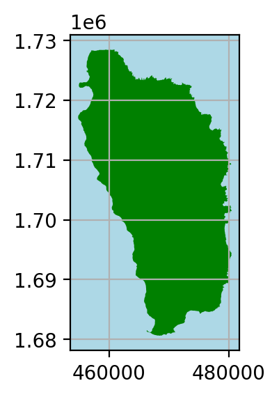

```{r setup, include=FALSE}
knitr::opts_chunk$set(echo = FALSE)
```

```{r}
#load R libraries
# load libraries
librarian::shelf(
  reticulate,
  devtools)

# show library versions and paths
session_info() 

# install Python into user space
(reticulate::miniconda_path()) # show the Python path
if (!file.exists(reticulate::miniconda_path()))
  reticulate::install_miniconda()
```


```{python}
#load libraries 
import pandas as pd
import geopandas as gpd
import matplotlib.pyplot as plt
import os
import numpy as np
from shapely.geometry import Polygon
```

# Dominica Outline

Import shape file for Dominica. 

```{python}
input_folder = r"data/dominica"
dominica_shapefile = "dma_admn_adm0_py_s1_dominode_v2.shp"

dominica_fp = os.path.join(input_folder, dominica_shapefile)
```

Read file using `file_path()`

```{python}
dominica_data = gpd.read_file(dominica_fp)
```

```{python}
dominica_2002 = dominica_data.to_crs("EPSG:2002")
```

```{python}
fig, ax = plt.subplots(figsize=(3, 3), dpi=200)
ax.grid(True)
ax.set_facecolor('lightblue')

dominica_2002.plot(ax = ax, color = 'green')
```



