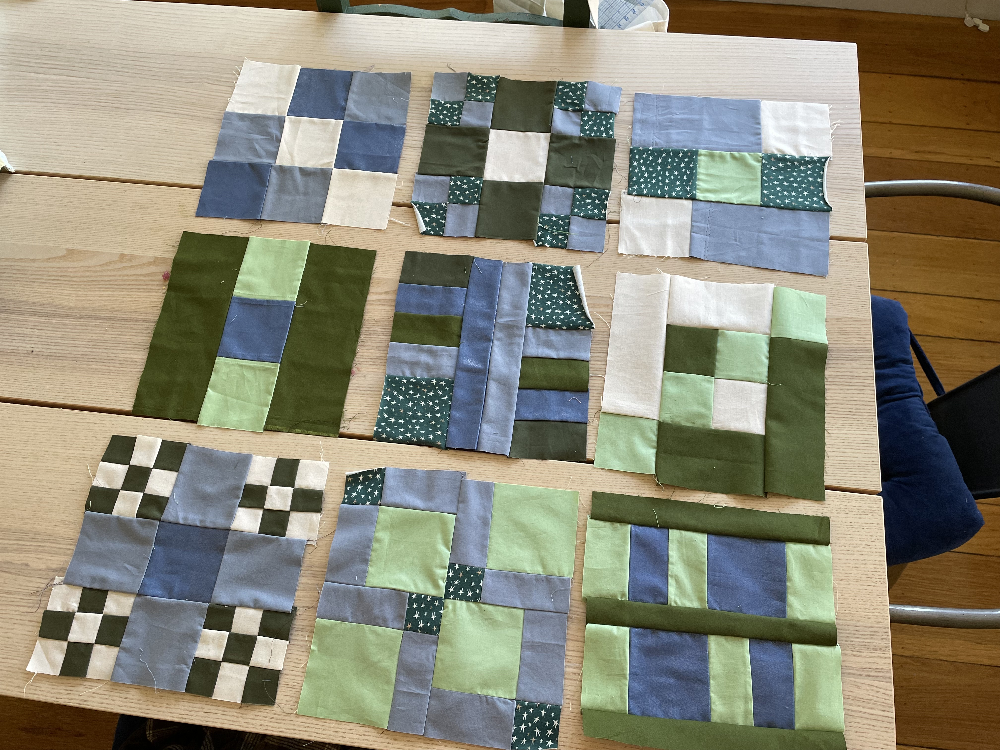
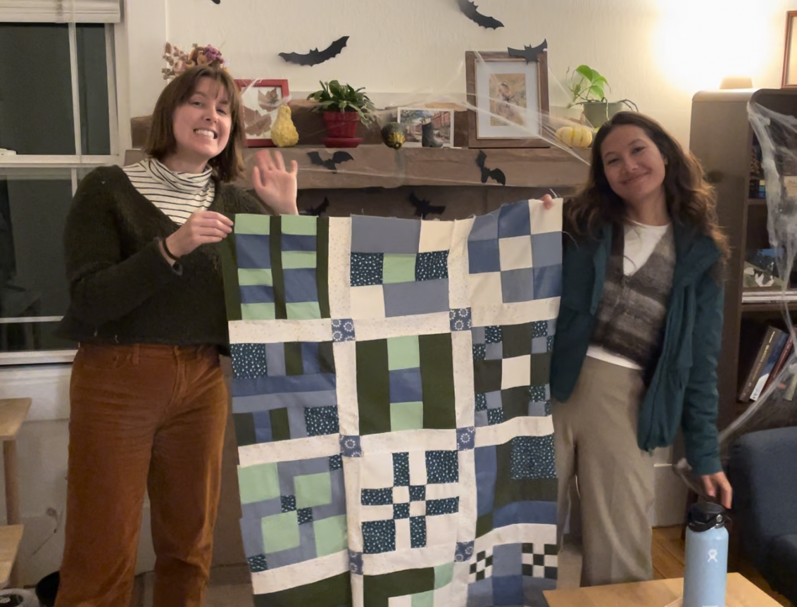

# About

In October of 2024, I took a quilting class after having started sewing earlier in the year. To take my sewing skills to the next level, the course requirements asked me to show up to class #1 with 5-9 woven cotton fabrics. 

Color choice is the part of crafts I feel least comfortable with. Sewing, like my knitting, and like much of the programming and data analysis I do, can be quite formulaic. I feel comfortable troubleshooting straightforward problems with clear solutions. Color choice feels like more of a design choice, although I'd love to take color theory coursework to help it feel more structured, and so my pre-class homework felt overwhelming.

To overcome the overthinking of color choices, I pulled hex code from some fabric shop websites, kept them in a Google Sheets spreadsheet with their respective URLs, and tested what a quilt might look like using the hex codes and `ggplot2`. 

This combination of crafts and R is very simple, but it was a joyful way to use some functions I work with daily for a very _me_ purpose.

# Code

## Load Libraries

Here are the packages I used. `ARTofR` is constantly on rotation for me, as I love the beauty of a thoughtfully organized R file. It's useless here in this .Rmd for my `distill` site, but I'll still show it love. 

`googlesheets4` is massively important for my work in OUSD. I work for a department of frequent Google Drive users, and I've `googlesheets4`-ed my way to some beautiful integration with student information system data with program data managed in Drive. 

```{r}
#install and load librarian package if needed
if (!require(librarian)) {
  install.packages("librarian")
  library(librarian)
}

# load packages
shelf(tidyverse, 
      here, 
      ARTofR, 
      ggplot2, 
      gridExtra, 
      googlesheets4)
```

## Get Hex Codes and Randomize Color Selection

As I shopped for fabric, when I noticed colors that inspired me in the required fabric specifications, I'd grab the URL and throw it in this [Google Sheet](https://docs.google.com/spreadsheets/d/1bCFgHr1KwrBOcmKiO_k-jonU9haHtGD3Orw6rOVbw00/edit?gid=0#gid=0). I'd also use a [Google Chrome Extension](https://chromewebstore.google.com/detail/colorpick-eyedropper/ohcpnigalekghcmgcdcenkpelffpdolg?hl=en&pli=1) for picking colors from the web, then add the hex code to the sheet.

When I copy-paste from the color picker Extension, the hashtag isn't included, so I add that below and then define a random selection of 5-9 colors to play around with when visualizing my potential quilt.

```{r}
#  As I've been fabric shopping, I've kept a Google Sheet with URLs for
#  fabrics of interest and hex codes for the main colors from those fabrics.
hex_codes_data <- read_sheet('https://docs.google.com/spreadsheets/d/1bCFgHr1KwrBOcmKiO_k-jonU9haHtGD3Orw6rOVbw00/edit?gid=0#gid=0')

# Add '#' to the hex codes
hex_codes_data <- hex_codes_data %>%
  mutate(hex_code = paste0('#', 
                           hex_code))

# Define the number of colors to randomly select (between 5 and 9)
n_colors <- sample(5:9, 1)

# Randomly sample the hex codes
custom_palette <- sample(hex_codes_data$hex_code, n_colors)
```

## Create a Sample Quilt Block

Using those randomized colors, I applied a custom function below. It utilizes `ggplot2` to produced a 3x3 grid of 9-patch quilt blocks, which are a basic America quilt block. This is not what my quilt class quilt would be, but it allowed me to get a sense of how my colors might look together as blocks. 

I ran this many times, examined the outcomes, and saved the palettes that I liked as additional tabs in my Google Sheets document. This way, I could call them back later as input to my function when making final decisions about fabric choices. 

```{r}
# Function to create a quilt block with a checkered pattern of two colors
create_quilt_block <- function(custom_palette) {
  # Create a data frame for grid coordinates
  blocks <- expand.grid(x = 1:3, 
                        y = 1:3)
  
  # Select two random colors for the block
  selected_colors <- sample(c(custom_palette), 2)
  
  # Assign colors in a checkered pattern (alternating between the two colors)
  blocks$color <- ifelse((blocks$x + blocks$y) %% 2 == 0, 
                         selected_colors[1], 
                         selected_colors[2])
  
  # Create the plot
  ggplot(blocks, aes(x = x, 
                     y = y, 
                     fill = color)) +
    geom_tile(color = "white", size = 1) +  # Create tiles with white borders
    scale_fill_identity() +                 # Use the exact colors provided
    coord_equal() +                         # Ensure square tiles
    theme_void()                            # No axis or labels
}

# Function to create a quilt with multiple blocks
create_quilt <- function(colors, 
                         n_blocks = 9) {
  
  plots <- lapply(1:n_blocks, function(x) create_quilt_block(colors))
  grid.arrange(grobs = plots, ncol = 3)  # Arrange quilt blocks in a grid
  
}

# Generate a quilt with 9 blocks using the randomly selected color palette
create_quilt(custom_palette, n_blocks = 9)
```

I'm very inspired by the work of the Generative aRt community online, but due to my color-choice hesitancy, I feel timid to explore Generative aRt, myself. I think I feel similarly about physical aRt. This exercise was perhaps an attempt at Generative cRafts, which I think I've just made up :) 

# Quilt, IRL!

Finally, here's a look at the results of this fabric-shopping tool:




