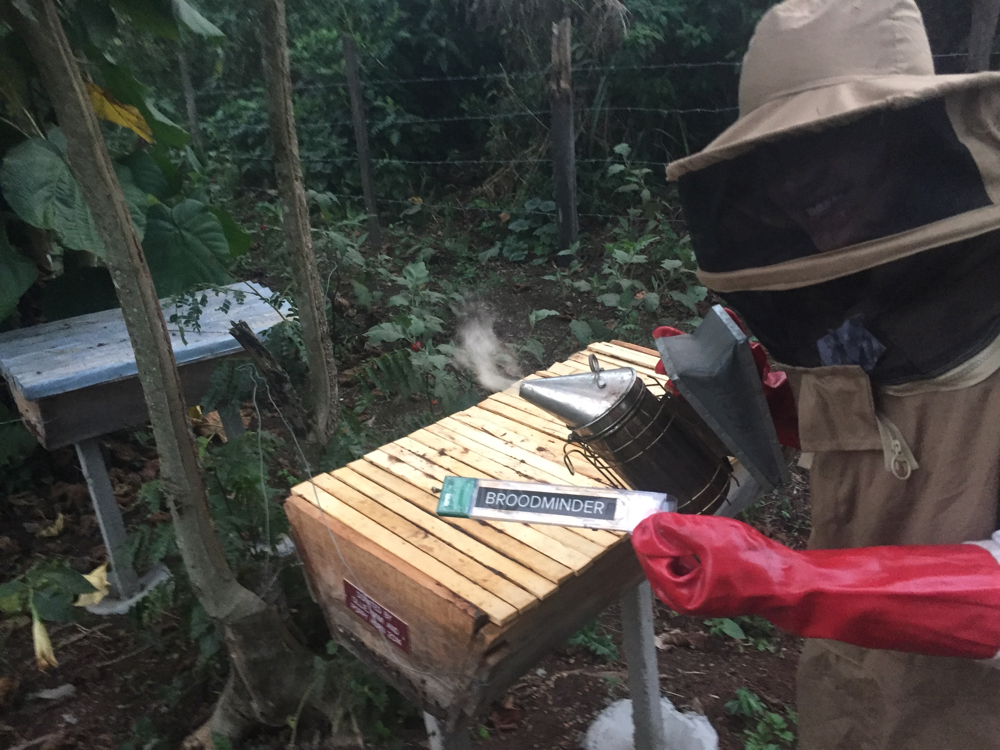

```{r setup, include=FALSE}
knitr::opts_chunk$set(echo = FALSE)
```

Scout Leonard graduated from Harvard College in 2018 with her BA in Integrative Biology and minor in Energy and the Environment. During college, Scout led consulting projects for nonprofits such as the [Planetary Health Alliance](https://www.planetaryhealthalliance.org/planetary-health) as a project leader in the Harvard College Conservation Society. She also conducted research with [Professor Brian Farrell](https://farrell.oeb.harvard.edu) on island endemism and plant phylogenetics. 

<center>


</center>

Supported by the Weissman Fellowship, Scout created apiary management systems for forest-edge hives in Kibale National Forest, Uganda, with the [Kasiisi Project](https://www.kasiisiproject.org). These “beehive-fences” have conservation, economic, and social benefits, even to this day; they reduce human-elephant conflict and provide income to farmers. This project inspired Scout’s interest in multidisciplinary sustainability projects, particularly those that emphasize environmental justice. 

<center>



</center>

As such, Scout has spent the last 3 years working on urban food systems in Oakland, California with [No Kid Hungry](https://www.nokidhungry.org) and [FoodCorps](https://foodcorps.org). She oversaw food system programs by managing procurement, participation, and waste data across the city; Scout believes that every person has the right to nutritious food, and her work expanded access to healthy school meals for Oakland. Using data science, Scout hopes to transform human-environmental systems to be more sustainable and equitable.

<center>


</center>
